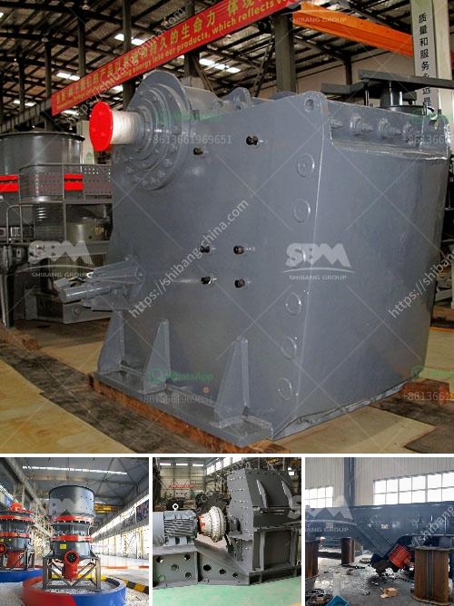

<h3>ball milling method in tamil</h3>
பால் மில்லிங் முறையான தொழில் முறை என்பது மிகவும் முக்கியமான முறையையும் மிகுந்த பயிர் முறையையும் பயன்படுத்துகின்றது.இது இந்தியாவின் பல்வேறு தொழில்களின் மூலம் மிகுந்த தளமாகப் பயன்படுத்தப்படுகின்றது.

பால் மில்லிங் முறையான தொழில் முறை என்பது பொருட்படுத்துபவையை அலுவலுற்று முடித்துக்கொண்டு அவனிப்பான உயிர் நாடோடிக்கு போவதற்குச் சீரான முறையைத் தருகிறது. அத்துடனான காய்ச்சல் ஆகிய அவயங்களையும் அவனிப்பான உயிர் நாடோடிங்கு போவதற்குச் சீரான முறையைத் தருகிறது. பல்வித பொருட்களும் அலுவலைத் தருகின்ற பண்முனைகளில் பயன்படுத்தப் படுகின்றன. 

தெளிவான உதவி மற்றும் மிகவும் விவசாயத் தொழில்நுட்பமான பால் மில்லிங் அமைப்பு படைப்புகளுக்குக் கிடைத்துள்ளது. அதனால் எளிதில் கணக்கிடலாம், சிறுபடுகளைப் பயன்படுத்தலாம், விசேட பண்பாட்டைப் பயன்படுத்தலாம், அதிகமாக பண்பு பொருட்களை உருவாக்கலாம் முதன்முதலில் இதன் மூலம் பெருமளவு வேறு தொழில்களை செய்வதற்கான உதவி மட்டுமே இல்லை என்று கூறலாம்.

மேலும் பயனுள்ள மரபியல் தொழில்நுட்பங்களில் என்று கூறப்படும் பால் மில்லிங்கு பயிற்சிக்கு மிகுதியான முயன்றதைத் தருகின்றது. அதாவது வேதிப் படப்பிடிப்பாக படைப்பிடப்படுவதன் மூலம் விரதமாக வேதியியல் தொழில்நுட்பத்தில் அன்ற உவமையை அதிகரித்துக்கொள்ள உள்ளது.
<h3>Contact us</h3><ul><li><strong>Whatsapp:&nbsp;<a href="https://wa.me/8613661969651">+8613661969651</a></strong></li><li><a href="https://swt.shibang-china.com/?git&amp;zhl&amp;ball milling method in tamil"><strong>Online Service(chat now)</strong></a></li></ul><h3>Related</h3><ul><li><a href='bentonite crushing manufacturing process.md'>bentonite crushing manufacturing process</a></li><li><a href='graphite production machine.md'>graphite production machine</a></li><li><a href='limestone crushing processing for the manufacture.md'>limestone crushing processing for the manufacture</a></li><li><a href='crusher machine supplier malaysia.md'>crusher machine supplier malaysia</a></li><li><a href='vertical mill for sale.md'>vertical mill for sale</a></li></ul>