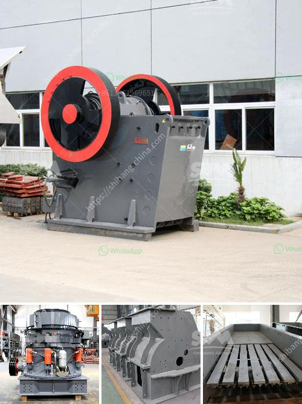

<h3>ball mills 7 x 12 usa</h3>
Ball mills are essential equipment for grinding and crushing materials in various industries, including cement, silicate, new-type building materials, refractory materials, fertilizers, ferrous and non-ferrous metals beneficiation, and glass ceramics. One popular type of ball mill on the market is the 7 x 12 USA model, known for its reliability and efficiency in grinding tasks.

The 7 x 12 USA ball mill is a horizontal rotating device driven by an external gear. The materials are evenly transferred into the first chamber of the mill through a feed device, where there are step liner plates or corrugated liner plates to enhance the grinding efficiency. The cylindrical rotating rotor helps to generate centrifugal force, which brings the steel balls to a certain height and then allows them to fall, impacting and grinding the materials. The fine powder is discharged through the discharge grate plate located at the end of the ball mill.

One of the standout features of the 7 x 12 USA ball mill is its large capacity. Capable of processing materials ranging from small stones to larger ores, this heavy-duty machine boasts a throughput range of 40-60 tons per hour. The size range of the materials that can be processed by the mill is approximately 0.075-0.89mm, making it suitable for both coarse and fine grinding tasks. Additionally, the machine is equipped with a motor power of 130kw, ensuring efficient grinding performance and reducing energy consumption.

In terms of maintenance, the 7 x 12 USA ball mill is designed to be easily maintained and repaired. With its simple structure and convenient operation, operators can quickly perform routine maintenance tasks and troubleshoot any issues that may arise, ensuring minimal downtime and maximizing productivity.

Overall, the 7 x 12 USA ball mill is a reliable and efficient equipment for grinding and crushing various materials. Its large capacity, easy maintenance, and high-quality grinding performance make it a popular choice for industries that require efficient size reduction processes. Whether it is used in mining, construction, or chemical industries, this ball mill provides an essential solution for achieving desired particle sizes and meeting production goals.
<h3>Contact us</h3><ul><li><strong>Whatsapp:&nbsp;<a href="https://wa.me/8613661969651">+8613661969651</a></strong></li><li><a href="https://swt.shibang-china.com/?git&amp;zhl&amp;ball mills 7 x 12 usa"><strong>Online Service(chat now)</strong></a></li></ul><h3>Related</h3><ul><li><a href='jaw crusher supplier of new zealand.md'>jaw crusher supplier of new zealand</a></li><li><a href='used basalt stone crusher price in uae.md'>used basalt stone crusher price in uae</a></li><li><a href='coal mining equipment south africa for sale.md'>coal mining equipment south africa for sale</a></li><li><a href='list mines and quarry owners of malaysia.md'>list mines and quarry owners of malaysia</a></li><li><a href='basalt curb stone crusher price.md'>basalt curb stone crusher price</a></li></ul>