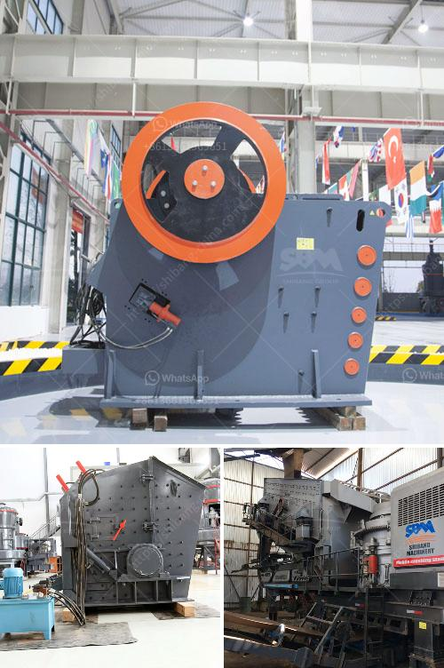

<h3>ball mills at best price in india</h3>
In the ever-developing world, industrial processes are becoming more and more efficient. One of the instruments that exemplifies this progress is the ball mill. It is a mechanical device used to grind and blend various materials into fine powder, making it an essential piece of equipment for many industries.

In India, the demand for ball mills has been steadily rising due to their low operation cost and reliable performance. However, buyers should be aware of the best price available in the market to ensure they get the most value for their purchase.

Several factors determine the best price for ball mills in India. The first and foremost consideration is the quality and durability of the equipment. It is essential to invest in a ball mill that is made from high-quality materials to ensure its longevity and efficiency. Inferior quality mills may offer a lower upfront price but will result in higher maintenance costs and frequent breakdowns in the long run.

The second factor affecting the price of ball mills is the manufacturing process and technology used. Technologically advanced mills tend to have a higher price tag, but they offer various advantages such as improved productivity, energy efficiency, and precise control over the grinding process. These advancements can greatly benefit industries, especially those involved in the production of chemicals, ceramics, and pharmaceuticals.

Additionally, the size and capacity of the ball mill also play a crucial role in determining its price. Ball mills come in different sizes, ranging from small laboratory models to large industrial-grade mills. The larger the size and capacity, the higher the cost. Buyers should carefully analyze their requirements and choose a ball mill that suits their production needs without compromising on quality or performance.

Furthermore, the reputation and credibility of the manufacturer or supplier should not be overlooked when considering the best price for ball mills in India. It is advisable to opt for renowned manufacturers who have a proven track record of delivering high-quality and reliable equipment. Reputable manufacturers often provide after-sales services, technical support, and warranty, ensuring the buyer's peace of mind.

To find the best price for ball mills in India, buyers can explore various platforms such as online marketplaces, industrial exhibitions, and industry-specific magazines. Comparing prices and features from different suppliers can help buyers make an informed decision and strike the best deal. It is also recommended to seek recommendations from industry experts or consult with experienced professionals to identify reliable suppliers.

In conclusion, ball mills are indispensable in many industries, and finding the best price in India requires careful consideration of factors such as quality, manufacturing technology, size, capacity, and the reputation of the manufacturer. Investing in a high-quality ball mill will result in improved productivity, reduced maintenance costs, and overall operational efficiency. With thorough research and due diligence, buyers in India can find the best price for ball mills and maximize their return on investment.
<h3>Contact us</h3><ul><li><strong>Whatsapp:&nbsp;<a href="https://wa.me/8613661969651">+8613661969651</a></strong></li><li><a href="https://swt.shibang-china.com/?git&amp;zhl&amp;ball mills at best price in india"><strong>Online Service(chat now)</strong></a></li></ul><h3>Related</h3><ul><li><a href='china quarrying machine prices china.md'>china quarrying machine prices china</a></li><li><a href='iron ore magnetic separation from titanium process.md'>iron ore magnetic separation from titanium process</a></li><li><a href='mobile crusher malaysia for sell.md'>mobile crusher malaysia for sell</a></li><li><a href='used roller mill in kenya.md'>used roller mill in kenya</a></li><li><a href='clay working clay powder making machine.md'>clay working clay powder making machine</a></li></ul>