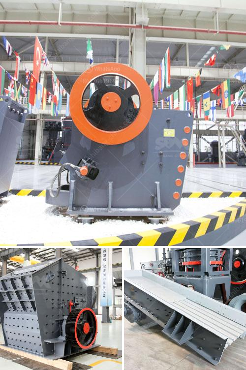

<h3>ball mills layout</h3>
Ball mill is the key equipment for grinding materials after crushing. It is widely used in mining, construction, ceramics and other industries, and can be used for both dry and wet grinding. The ball mill is composed of a horizontal cylinder, a hollow shaft for feeding and discharging materials, and a grinding head with a grinding body.

The layout of the ball mill is an important factor affecting the production efficiency and processing capacity of the equipment. There are many factors that affect the layout of the ball mill, such as the structure, the type and shape of the lining plate, the location of the feeding and discharging ports, the grinding medium (steel ball) filling rate, and the rotation speed of the cylinder.

Firstly, the structure of the ball mill should be reasonable and compact. The length and diameter ratio of the cylinder should be selected according to the specific working conditions and production requirements to ensure the grinding efficiency and processing capacity. The length of the cylinder is generally 1.5-2.5 times the diameter.

Secondly, the lining plate plays an important role in protecting the cylinder and improving the grinding efficiency. The type and shape of the lining plate should be selected according to the characteristics of the grinding material. The smoothness and flatness of the lining plate are also important factors affecting the grinding effect.

Thirdly, the location of the feeding and discharging ports should be reasonable and convenient for material feeding and discharging. Properly setting the inclination angle of the feeding and discharging ports can improve the flowability of materials and reduce the phenomenon of material blocking.

Furthermore, the grinding medium (steel ball) filling rate and the rotation speed of the cylinder are also important factors affecting the grinding efficiency. The filling rate and the rotation speed should be adjusted according to the properties of the grinding materials to achieve the best grinding effect.

In conclusion, the layout of the ball mill is crucial for efficient grinding and processing. The proper structure, lining plate, and the location of the feeding and discharging ports, as well as the filling rate and rotation speed of the cylinder, should all be considered to ensure the best grinding performance of the ball mill.
<h3>Contact us</h3><ul><li><strong>Whatsapp:&nbsp;<a href="https://wa.me/8613661969651">+8613661969651</a></strong></li><li><a href="https://swt.shibang-china.com/?git&amp;zhl&amp;ball mills layout"><strong>Online Service(chat now)</strong></a></li></ul><h3>Related</h3><ul><li><a href='mobile quarry plant.md'>mobile quarry plant</a></li><li><a href='fine grinding equipment.md'>fine grinding equipment</a></li><li><a href='plant for manufacturing of wet ground calcium carbonate.md'>plant for manufacturing of wet ground calcium carbonate</a></li><li><a href='dolomite crusher manufacturer in usa.md'>dolomite crusher manufacturer in usa</a></li><li><a href='diamond stone crusher mumbai.md'>diamond stone crusher mumbai</a></li></ul>