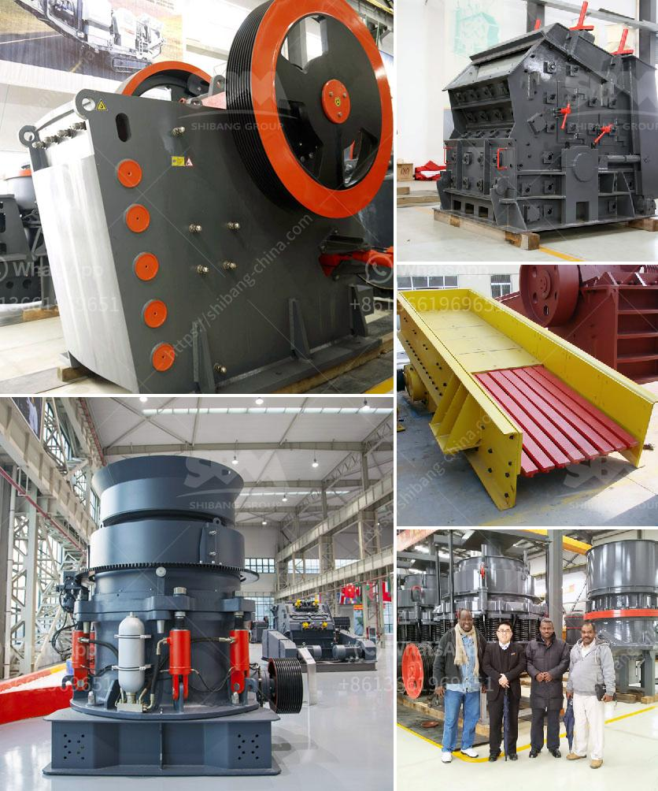

<h3>ball mills price</h3>
Ball mills are widely used in the production of cement, silicate products, new building materials, refractory materials, fertilizers, black and non-ferrous metal dressings, and glass ceramics. They are used for dry or wet grinding of various ores and other grindable materials. The ball mill is a versatile grinding equipment that is capable of grinding and drying various materials used in mineral processing, construction, and chemical industries.

Ball mills are typically designed with a diameter-to-length ratio of 1:1.5 and a barrel diameter of 800-3,200mm. The length of the barrel is usually 1.5-2 times the diameter. The longer the barrel, the higher the processing capacity. Ball mills are usually operated at 75% of the critical speed. If the speed is too high, the grinding media will centrifuge, and if too low, the media will slide. The ball mill price varies depending on the specifications and capacity.

Low-capacity mills typically have a lower price tag compared to high-capacity mills. However, low-capacity ball mills are not commonly used in large-scale mineral processing plants. It is rather used as a laboratory equipment for small-scale mineral processing. Laboratory ball mills are also referred to as planetary ball mills or centrifugal ball mills. They can be part of a continuous grinding and dispersion system, as well as standalone devices.

The price of ball mills varies depending on the different specifications and sizes. Since they are several feet in diameter, these industrial ball mills consume high energy while grinding materials. Therefore, the quality and durability of ball mills are important considerations when choosing grinding equipment.

Apart from the size of the mill, other variables that influence the price of ball mills include its capacity, power, material, and size of the grinding media. The production costs associated with the materials and manufacturing processes also contribute to the final price.

In addition to considering the price, it is essential to choose a reliable ball mill manufacturer. A reputable manufacturer will have advanced production technology, high-quality materials, and provide after-sales service and technical support. They should also comply with international quality standards to ensure that the equipment meets the required specifications and delivers optimal performance.

When comparing ball mill prices from different manufacturers, it is crucial to carefully assess the features and specifications offered by each manufacturer. Some manufacturers may offer additional features such as automatic lubrication systems, energy-saving capabilities, and control systems. These additional features could justify a higher price if they meet the specific needs and requirements of the buyer.

In conclusion, ball mills are essential grinding equipment widely used in mineral processing plants, construction, and chemical industries. The price of ball mills varies depending on their specifications, capacity, and features. It is important to choose a reputable manufacturer that offers high-quality equipment, compliance with international standards, and after-sales support. Considering these factors will ensure that the chosen ball mill meets the processing requirements and delivers efficient and reliable performance.
<h3>Contact us</h3><ul><li><strong>Whatsapp:&nbsp;<a href="https://wa.me/8613661969651">+8613661969651</a></strong></li><li><a href="https://swt.shibang-china.com/?git&amp;zhl&amp;ball mills price"><strong>Online Service(chat now)</strong></a></li></ul><h3>Related</h3><ul><li><a href='floatation equipment iron ore beneficiation germany.md'>floatation equipment iron ore beneficiation germany</a></li><li><a href='manganese ore sintering process.md'>manganese ore sintering process</a></li><li><a href='plant machinery manufacturers in germany.md'>plant machinery manufacturers in germany</a></li><li><a href='calcium carbonate plant industry.md'>calcium carbonate plant industry</a></li><li><a href='gravel washing plant for sale in uk.md'>gravel washing plant for sale in uk</a></li></ul>