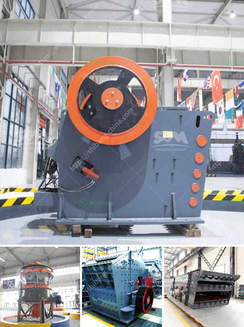

<h3>ball mills prices</h3>
Ball mills are widely used in the mining industry, construction industry, and chemical industry and other sectors to grind all kinds of ores and rocks. They are characterized by their low cost, simple structure, high grinding efficiency, low energy consumption, reliable performance, and easy operation. 

When it comes to ball mill prices, there are several factors that can influence the final price. The size and capacity of the ball mill are the most significant factors. The larger the size, the more expensive it is. At the same time, the larger the capacity, the higher the price. 

Another important factor is the brand and manufacturer. Well-known and reputable brands tend to have higher prices due to their quality and reliability. They often have better after-sales service and higher customer satisfaction rates. However, there are also some lesser-known brands that offer competitive prices without compromising on quality.

The cost of materials and labor is another factor that affects ball mill prices. The cost of raw materials, such as steel, can fluctuate, causing variations in prices. Labor costs also play a role, as some countries have lower labor costs, resulting in lower overall prices.

Additionally, the specific model and features of the ball mill can affect the price. Some ball mills come with additional features such as automatic lubrication systems or temperature control mechanisms, which can increase the price. However, these features can enhance the efficiency and performance of the mill, making them worth the investment in the long run.

When comparing ball mills prices, it is essential to consider the overall value and cost-effectiveness rather than merely focusing on the initial price. A higher-priced mill with better quality and performance can offer more significant benefits and savings in the long term.

In conclusion, ball mill prices can vary depending on various factors such as size, capacity, brand, manufacturer, materials, labor costs, and additional features. It is important to carefully evaluate all these factors and choose a ball mill that offers the best value for money while meeting the specific needs of the application.
<h3>Contact us</h3><ul><li><strong>Whatsapp:&nbsp;<a href="https://wa.me/8613661969651">+8613661969651</a></strong></li><li><a href="https://swt.shibang-china.com/?git&amp;zhl&amp;ball mills prices"><strong>Online Service(chat now)</strong></a></li></ul><h3>Related</h3><ul><li><a href='equipment required for producing lime for new plant.md'>equipment required for producing lime for new plant</a></li><li><a href='mining equipment for sale zimbabwe.md'>mining equipment for sale zimbabwe</a></li><li><a href='stone jaw crusher ppt for seminar.md'>stone jaw crusher ppt for seminar</a></li><li><a href='alluvial gold mining equipment china.md'>alluvial gold mining equipment china</a></li><li><a href='crusher unit price.md'>crusher unit price</a></li></ul>