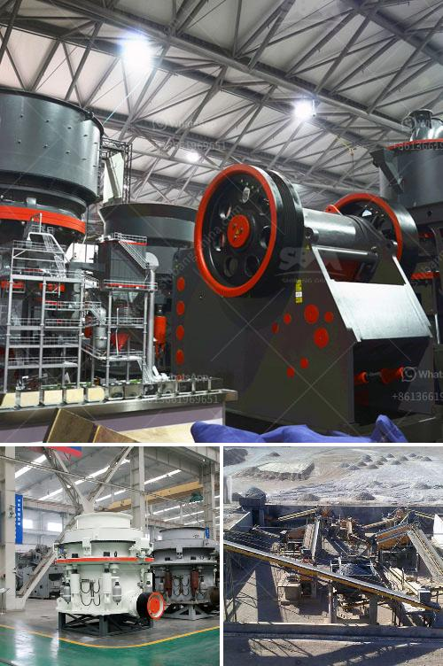

<h3>ball mills spain</h3>
In the world of manufacturing and machinery, ball mills are one of the essential equipment used for grinding and crushing materials into smaller pieces. This versatile machine finds its application in various industries, including mining, construction, and pharmaceuticals.

Spain has always been a hub for technological advancements and, when it comes to ball mills, the country has a significant contribution to make. Spanish manufacturers have mastered the art of designing and manufacturing top-notch ball mills that cater to the diverse needs of industries worldwide.

Ball mills are cylindrical devices used to grind materials such as minerals, ores, ceramics, and paints. The rotation of the mill barrel causes the material to be crushed, impacted, and ground by the grinding media and materials themselves. The resulting product is a finely ground powder or slurry, depending on the application.

Spanish ball mills are known for their precision engineering and high-quality materials, ensuring durability and performance. These mills use different types of grinding media, such as steel balls, ceramic balls, or cylpebs, depending on the material being processed. The size and composition of the grinding media also play a crucial role in achieving the desired final product.

One key advantage of ball mills is their adaptability to different materials and grinding processes. They can be used for dry or wet grinding, and the grinding can be performed in a batch or continuous mode. This versatility makes ball mills suitable for a wide range of applications.

In the mining industry, ball mills are used to grind ores and minerals, including copper, gold, iron ore, nickel, and lead-zinc. These mills play a vital role in the extraction process by breaking down the mined material into a finer grain size, allowing efficient separation of valuable minerals.

In the construction industry, ball mills are used for cement grinding. The powdered cement is mixed with water to form a paste, which is then hardened to create concrete. Ball mills are employed to ensure a consistent particle size distribution, resulting in high-quality, uniform cement.

Pharmaceutical companies also rely on ball mills for various applications, such as grinding and blending active ingredients. The precise control of grinding parameters ensures the desired particle size distribution and homogeneity required for pharmaceutical formulations.

Spanish ball mill manufacturers continuously strive to improve the design and performance of their machines. Advanced technologies, such as computer-aided design (CAD), are utilized to optimize the mill's efficiency and reduce energy consumption. Strict quality control measures are implemented at every stage of production to deliver reliable and efficient ball mills.

Furthermore, manufacturers in Spain cater to the global market demand by adhering to international standards and certifications. They also offer customization options to meet specific industry requirements and provide after-sales service and technical support for maintenance and troubleshooting.

In conclusion, ball mills are versatile machines that find application in various industries. Spanish manufacturers have established a commendable reputation for producing high-quality ball mills. Their precision engineering, use of premium materials, and adherence to international standards make Spanish ball mills a popular choice for industries worldwide. With ongoing advancements in technology, the future of ball mills in Spain looks promising, ensuring continuous innovation and improved efficiency in grinding and crushing operations.
<h3>Contact us</h3><ul><li><strong>Whatsapp:&nbsp;<a href="https://wa.me/8613661969651">+8613661969651</a></strong></li><li><a href="https://swt.shibang-china.com/?git&amp;zhl&amp;ball mills spain"><strong>Online Service(chat now)</strong></a></li></ul><h3>Related</h3><ul><li><a href='stone crusher for sale.md'>stone crusher for sale</a></li><li><a href='grinding of ceramic minerals.md'>grinding of ceramic minerals</a></li><li><a href='150 ton per hour gold wash plant.md'>150 ton per hour gold wash plant</a></li><li><a href='crusher machine supplier malaysia.md'>crusher machine supplier malaysia</a></li><li><a href='stone crushing process costs.md'>stone crushing process costs</a></li></ul>