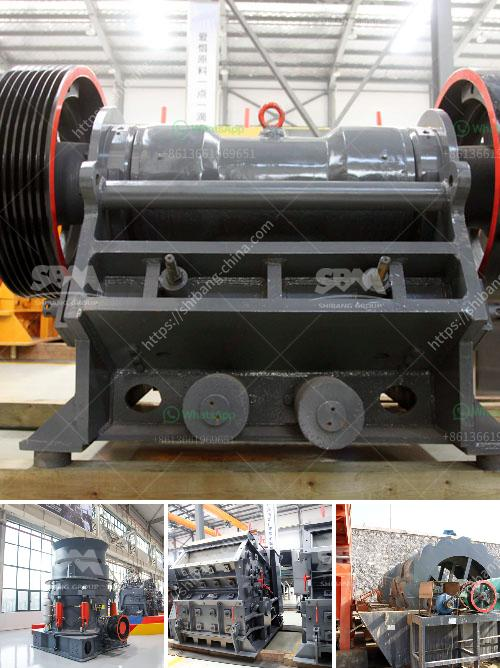

<h3>ballast crusher cost</h3>
Ballast refers to the stones or sand placed beneath the railroad tracks. It is an essential part of the railway construction. In essence, ballast crusher cost can be categorized into two types: the first is ballast crushing machine price, and the second is ballast screening machine price. These two levels of price can be negotiated.

The first type of ballast crusher machine price is influenced by the following factors: material type, processing capacity, and output size. To ensure optimum running costs of the crushing equipment, an operator should pay close attention to the following factors:

1. Proper selection of suitable materials: With the increasing demand for ballast materials, there are growing variations in the compositions of ballast stones. The material type of the crushing machine should be taken into consideration, ensuring the suitability and effectiveness of the machine in breaking down the specific material type.

2. Processing capacity: This refers to the quantity of ballasts that can be processed by the crusher within a specified period. A machine with a higher processing capacity will have a higher price compared to a lower-capacity machine.

3. Output size: The size of the final crushed ballast determines the overall ballast crushing machine cost. This is because the fine particles are not only easier to transport but also more efficient when it comes to the mixing process during railway construction.

The second type of machine that influences ballast crusher cost is the ballast screening machine. This is the machine that separates the stones and dust in the ballast before it is mixed with the cement. Ballast screeners can be divided into two categories: vibrating screens and trommel screens.

1. Vibrating screens: This type of screen is commonly used for smaller capacity requirements. It is more cost-effective and efficient in separating the ballast stones from the dust.

2. Trommel screens: These screens are suitable for larger capacity requirements. They are more expensive but provide a more thorough separation of the ballast stones, resulting in a higher quality final product.

The cost of a ballast screening machine will depend on the capacity and screen size required for the desired output.

In conclusion, the cost of a ballast crusher can be determined by numerous factors, including the material type, processing capacity, output size, and the type of screening machine. To get an accurate cost estimate, it is advisable to consult with reputable manufacturers or suppliers who can provide customized solutions based on specific requirements.
<h3>Contact us</h3><ul><li><strong>Whatsapp:&nbsp;<a href="https://wa.me/8613661969651">+8613661969651</a></strong></li><li><a href="https://swt.shibang-china.com/?git&amp;zhl&amp;ballast crusher cost"><strong>Online Service(chat now)</strong></a></li></ul><h3>Related</h3><ul><li><a href='graphite ore beneficiation.md'>graphite ore beneficiation</a></li><li><a href='mineral crusher processing plants china.md'>mineral crusher processing plants china</a></li><li><a href='hammer mill ghana.md'>hammer mill ghana</a></li><li><a href='frac sand processing plants for sale.md'>frac sand processing plants for sale</a></li><li><a href='difeerence between jow crusher and hammer mill.md'>difeerence between jow crusher and hammer mill</a></li></ul>