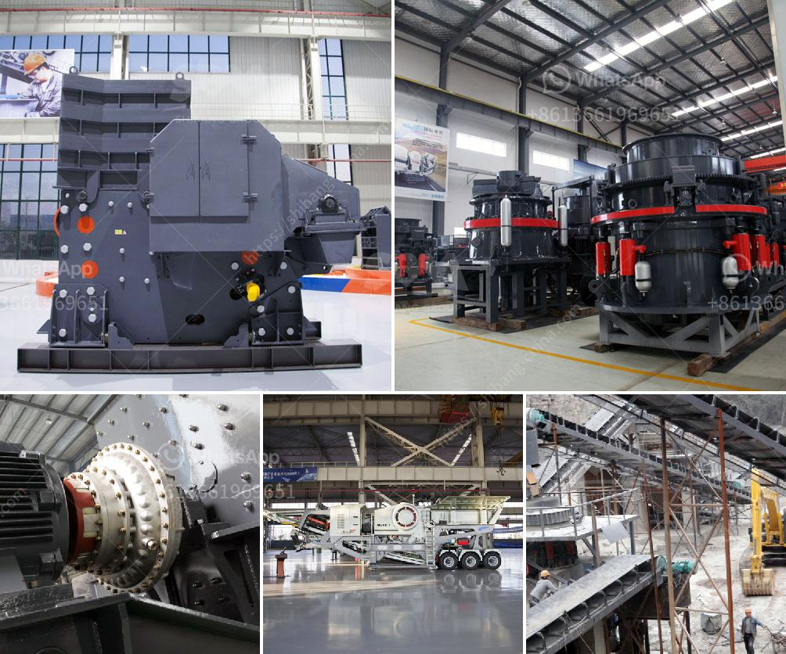

<h3>ballast crusher equipment</h3>
Railway construction is highly demanding as it requires the combination of several heavy machinery, equipment, and tools. Among them, one of the most essential pieces of equipment is the ballast crusher equipment. Rail ballast is crucial for maintaining railroads, ensuring their stability and durability throughout the years. Rail ballast is typically made from crushed granite or rocks such as limestone or quartzite, these aggregates contribute to the railway's track structure with its load-bearing properties.

Ballast crushing and screening plants are necessary to expedite the process of laying down the railway tracks. The ballast crushing plant includes stone crushers, screening equipment, and ballast cleaning systems. The crushing and screening equipment consists of jaw crushers, impact crushers, cone crushers, vertical shaft impact crushers, and vibrating screens among others.

Jaw crushers are primarily used as primary crushers. Their main purpose is to reduce the material to a small enough size that it can be transported by conveyors to the next stage of the crushing process. Just like the cone crushers, they perform secondary and tertiary crushing by compressing the material between them. Impact crushers, on the other hand, are used to crush softer, less abrasive materials like limestone. These types of crushers are typically used for crushing rocks that contain a higher amount of silica such as gravel and sand.

The ballast cleaning system cuts the vegetation, cleans the ballast, and redistributes the cleaned ballast. Ballast cleaning machines perform this task efficiently. Railways use ballast cleaning machines to clean ballast stones, removing fine debris and ensuring that the stones are properly crushed and shaped to improve the track's stability.

1. Ensures railway track stability: The ballast crusher equipment provides a new source of aggregates for the railway track ballast. With the increasing demand for ballast worldwide, traditional railway track beds are facing increasing pressure.

2. Combines economic development with ecological sustainability: Quarrying is required to supply crushed stone for use as railway ballast; however, quarrying activities can cause significant environmental damage. Ballast crusher equipment, which plays an important role in the railway construction process, recognizes the need for ecological conservation while satisfying the demands of economic development.

3. Enhances railroad safety: The proper installation and maintenance of railway track structures are essential for the safe operation of trains. The ballast crusher equipment, with its robust design and high-quality components, ensures reliable and consistent performance.

4. Facilitates railway maintenance: The ballast crushing and screening process is essential for the railway ballast system. Train authorities lso need ballast crushers to redirect and redistribute the crushed material.

In conclusion, the ballast crusher equipment plays a crucial role in the railway construction process, providing the necessary aggregates for the railway track structure. It ensures the stability, strength, and durability of the railways, contributing to the safety of passengers and the efficient functioning of the transportation system. As a result, investing in reliable ballast crusher equipment is essential for railway construction companies as they strive to achieve sustainable and efficient transportation networks.
<h3>Contact us</h3><ul><li><strong>Whatsapp:&nbsp;<a href="https://wa.me/8613661969651">+8613661969651</a></strong></li><li><a href="https://swt.shibang-china.com/?git&amp;zhl&amp;ballast crusher equipment"><strong>Online Service(chat now)</strong></a></li></ul><h3>Related</h3><ul><li><a href='kenya stone crusher in the philippines.md'>kenya stone crusher in the philippines</a></li><li><a href='design drawing of hopper for crusher.md'>design drawing of hopper for crusher</a></li><li><a href='mobile mining processing plant services.md'>mobile mining processing plant services</a></li><li><a href='small stone crusher for sale.md'>small stone crusher for sale</a></li><li><a href='marble grinder price in india.md'>marble grinder price in india</a></li></ul>