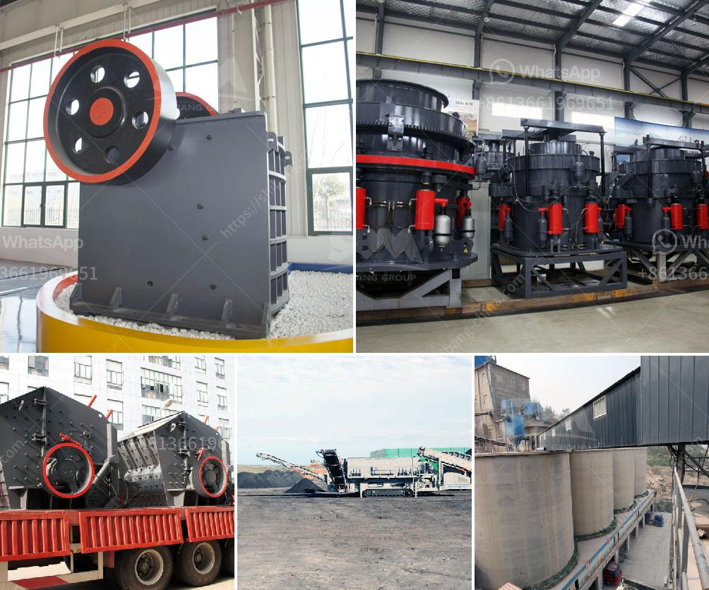

<h3>ballast crusher for sale in kenya</h3>
Many customers in Kenya are interested into the diesel engine ballast crushing machine, here I will introduce some hot small models for small mining and quarry plant.

Diesel engine stone ballast crusher machine is a type of diesel engine crusher . There is a simple type diesel engine stone ballast crushing machine, which is an only ballast crusher machine with a diesel engine. But now I introduce is a model which the crusher and diesel engine is on a structure and which can be designed into mobile type also.

Ballast crusher machine is a powerful machine used to break the larger rocks into smaller pieces. This type of crusher is mainly used for crushing granite, limestone, and sandstone. The crushing equipment operates by applying compressive strength to the material and crushing it until it breaks.

Choosing the right ballast crusher machine is key in determining the amount of money you will end up spending on ballast crusher machine. The machine uses electricity or diesel to operate the machine and has a minimum setting of 6 inches and maximum setting of 20 inches. The speed and the power of the crushing equipment varies depending on the type of material being crushed and the required output.

The size and capacity of the ballast crusher machine depend on the needs of the end users. The size and capacity of the crusher can be customized to fit the requirements of the customers. Users can choose the model that suits their production needs ranging from jaw crushers, cone crushers, impact crushers, and screens. It is known as the best mining crushing equipment manufacturers in China and the demand for ballast crusher machine is booming in Kenya.

In recent years, with the rapid development of the construction industry, especially the highway construction and infrastructure construction in Kenya, the demand for ballast crusher machine is increasing and more and more customers are flocking to the ballast crushing machine for sale.

The ballast crushing machine is an essential equipment for railway construction, which can be used to crush granite, limestone, basalt, cobble, and other materials. The crushing ratio is large, the size of the output can be adjusted conveniently, and the crushing efficiency is high. But how to purchase ballast crusher machine in Kenya?

There are several factors that should be taken into consideration, such as the capacity, power consumption, product quality, cost-effectiveness, etc. It is important to choose a reliable ballast crusher machine manufacturer and choose high-quality machines from the reputable ones. To ensure high-performance crushing and to minimize the potential for breakdowns, the equipment should have a robust construction and durable components.

In conclusion, the ballast crusher machine is a reliable and efficient crushing tool for railway construction. They are highly demanding in Kenya due to the booming construction and infrastructure development. Whether you are looking for a simple or mobile ballast crusher machine, he experts at Fote Machinery will provide you with a suitable solution. If you have any questions, please feel free to contact us.
<h3>Contact us</h3><ul><li><strong>Whatsapp:&nbsp;<a href="https://wa.me/8613661969651">+8613661969651</a></strong></li><li><a href="https://swt.shibang-china.com/?git&amp;zhl&amp;ballast crusher for sale in kenya"><strong>Online Service(chat now)</strong></a></li></ul><h3>Related</h3><ul><li><a href='potash ore crusher.md'>potash ore crusher</a></li><li><a href='quartz grinding ball mill working.md'>quartz grinding ball mill working</a></li><li><a href='grinding mill price.md'>grinding mill price</a></li><li><a href='diamond stone crusher price list.md'>diamond stone crusher price list</a></li><li><a href='crusherstone machine in china.md'>crusherstone machine in china</a></li></ul>