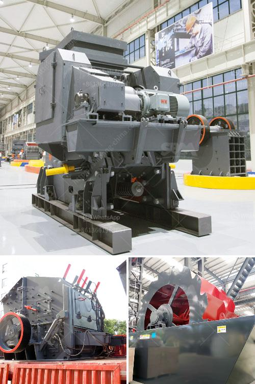

<h3>ballast crusher in kenya made in china</h3>
Ballast crusher is used for crushing stones into small pieces to produce railway ballast in large quantities. As we all know, ballast is the stones or sand that are laid underneath the railway tracks to provide stability and support. Customarily, it is made from crushed stones, but it can also be made from other materials like sand, gravel, or even slag.

Kenya, a country in East Africa, has abundant reserves of various types of natural resources, including ballast, which is a fundamental material for building and construction projects. With the increasing infrastructure development projects in Kenya, the demand for ballast crushers is growing rapidly. In order to meet this demand, many manufacturers have turned to China to source high-quality ballast crushers.

China, as a major manufacturing hub, has a rich experience and expertise in producing mining machinery. Chinese manufacturers have been producing various crushers for many years, and their machines have gained a good reputation for their high quality and excellent performance. These manufacturers use advanced technology and strict manufacturing processes to ensure the durability and reliability of their products.

Ballast crushers made in China are characterized by their sophisticated design, excellent craftsmanship, and long service life. Compared with traditional crushers, these machines can significantly increase the productivity and reduce the operation cost. They are also environmentally friendly due to their low noise and dust emission during operation.

In addition, ballast crushers made in China are cost-effective. The relatively low labor cost, as well as favorable exchange rates, make Chinese products more competitive in the global market. This cost advantage allows Kenyan customers to obtain high-quality ballast crushers at an affordable price, which ultimately benefits the local construction industry.

Another advantage of choosing ballast crushers made in China is the availability of spare parts. Chinese manufacturers have established a global after-sales service network, providing timely and efficient support for their customers. This ensures that if any part of the crusher requires replacement or repair, it can be easily obtained, minimizing downtime and ensuring uninterrupted production.

It is worth mentioning that Chinese manufacturers are not only providing ballast crushers but also offering comprehensive solutions for the entire crushing process. They can design and customize crushing plants according to the specific requirements of customers, including different sizes of ballast, production capacity, and even the material of the ballast.

In conclusion, ballast crushers made in China are an ideal choice for Kenyan customers. With their high quality, excellent performance, and cost-effectiveness, these machines play a crucial role in the construction industry, promoting the development of infrastructure in Kenya. By choosing ballast crushers made in China, customers are embracing the advanced technology and expertise that Chinese manufacturers provide, resulting in a win-win situation for both Kenya and China.
<h3>Contact us</h3><ul><li><strong>Whatsapp:&nbsp;<a href="https://wa.me/8613661969651">+8613661969651</a></strong></li><li><a href="https://swt.shibang-china.com/?git&amp;zhl&amp;ballast crusher in kenya made in china"><strong>Online Service(chat now)</strong></a></li></ul><h3>Related</h3><ul><li><a href='dolomite powder grinding mill in india.md'>dolomite powder grinding mill in india</a></li><li><a href='sand washing plant south africa.md'>sand washing plant south africa</a></li><li><a href='types of conveyors belts.md'>types of conveyors belts</a></li><li><a href='program to simulate conveyor belts.md'>program to simulate conveyor belts</a></li><li><a href='gold stone crusher machine south africa.md'>gold stone crusher machine south africa</a></li></ul>