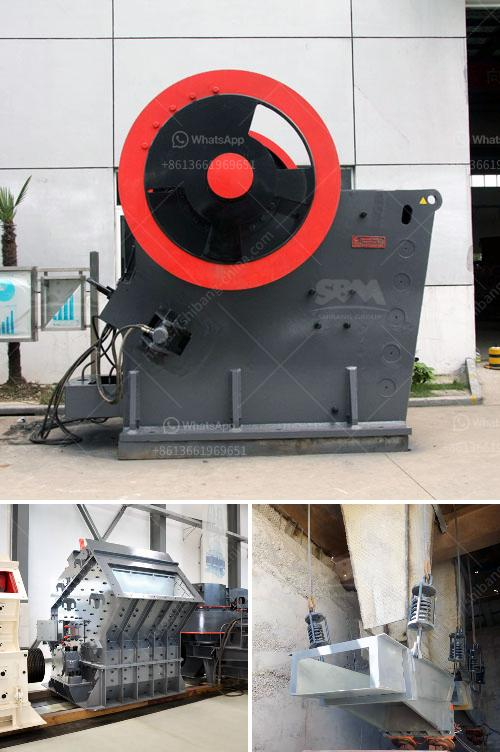

<h3>ballast crushing machine in kenya</h3>
Ballast crushing machine is a common crushing equipment in Kenya and is used in the crushing of various stones and rocks. It is widely used in sectors such as roads, railways, mining, building materials and energy. This is widely used during the construction process as ballast is a significant component in the construction of railways, roads and buildings.

Ballast crushing machine is a great choice for railway construction contractors, highway construction contractors and construction companies who have limited funds. It can improve the efficiency and cost-effectiveness of construction projects, reduce project costs and save the investment amount for developers.

The ballast crushing machine can be used as a primary or secondary crushing equipment for crushing coarse and medium-sized rocks and ores. As the first crushing equipment in the sand and gravel industry, graveling machines are widely used in various gravel production lines, and can effectively reduce the pressure of the follow-up crushing process.

With high efficiency, low energy consumption and uniform product size, ballast crushing machine is gradually becoming popular in the market. It has become a crushing equipment that people can't live without in the construction industry.

In conclusion, the ballast crushing machine in Kenya plays an important role in the construction sector, allowing contractors to effectively achieve cost savings and overall efficiency. It is a versatile and powerful machine that can be relied upon to crush rocks and stones effectively. As Kenya continues to strive towards infrastructure development, ballast crushing machines will play a key role in supporting the growth and development of the country.
<h3>Contact us</h3><ul><li><strong>Whatsapp:&nbsp;<a href="https://wa.me/8613661969651">+8613661969651</a></strong></li><li><a href="https://swt.shibang-china.com/?git&amp;zhl&amp;ballast crushing machine in kenya"><strong>Online Service(chat now)</strong></a></li></ul><h3>Related</h3><ul><li><a href='write an article about jaw crusher philippines prices with 100300 words.md'>write an article about jaw crusher philippines prices with 100-300 words</a></li><li><a href='stone crusher malaysia.md'>stone crusher malaysia</a></li><li><a href='ball mill for manufacturing.md'>ball mill for manufacturing</a></li><li><a href='salt crusher plant process price.md'>salt crusher plant process price</a></li><li><a href='fuel consumption of stone crushers.md'>fuel consumption of stone crushers</a></li></ul>