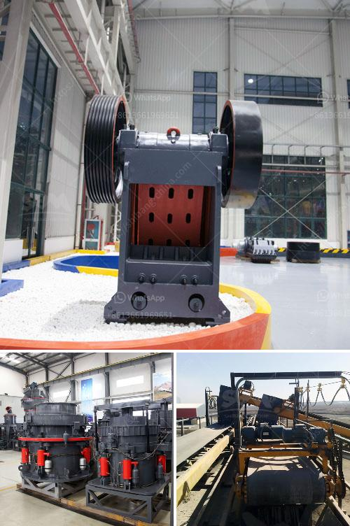

<h3>ballast processing machine</h3>
Ballast processing machines play a crucial role in maintaining the stability and reliability of railway tracks. These machines are specifically designed to efficiently process and recycle ballast - the crushed stones that are used as a foundation for railway tracks. The process of ballast processing involves cleaning, crushing, and redistributing the crushed stones to ensure that the tracks remain in optimal condition.

One of the primary functions of ballast processing machines is to clean the ballast material. Over time, the ballast can become contaminated with debris, such as dirt, dust, and organic matter. This contamination can reduce the effectiveness of the ballast in providing support to the tracks. Therefore, ballast processing machines are equipped with advanced cleaning mechanisms that efficiently remove these impurities from the ballast material. This cleaning process not only enhances the performance of the ballast but also contributes to the overall safety and stability of the railway tracks.

Another important aspect of ballast processing machines is the crushing function. During the operational lifespan of railway tracks, the ballast material can become worn out and damaged. The continuous exposure to heavy loads and extreme weather conditions can cause the stones to break or lose their shape. This can lead to track instability and an increased risk of accidents. To address this issue, ballast processing machines are equipped with powerful crushers that can effectively crush the damaged ballast material, thereby restoring its shape and strength. This crushed ballast is then redistributed along the tracks, providing a solid foundation for the trains to run on.

One of the key advantages of ballast processing machines is their ability to recycle the crushed ballast material. Instead of disposing of the damaged ballast, these machines can process it and reuse it for the tracks. The recycled ballast undergoes rigorous quality checks to ensure that it meets the required specifications for track stability and reliability. This recycling process not only reduces the need for new ballast material but also contributes to sustainable practices in the railway industry.

In terms of efficiency, ballast processing machines are designed to streamline the entire ballast processing process. These machines are equipped with advanced technologies, such as automated controls and sensors, that optimize the processing speed and accuracy. The incorporation of these technologies minimizes human error and increases productivity, saving both time and cost for railway authorities.

In conclusion, ballast processing machines are essential equipment in the railway industry for maintaining the stability and reliability of tracks. These machines efficiently clean, crush, and recycle ballast material, ensuring that the tracks remain in optimal condition. The advanced technologies incorporated in these machines enhance their efficiency and productivity, contributing to the overall safety and sustainability of the railway network. With the continuous advancements in these machines, the future of ballast processing looks promising, ensuring smooth and safe train journeys for passengers and cargo alike.
<h3>Contact us</h3><ul><li><strong>Whatsapp:&nbsp;<a href="https://wa.me/8613661969651">+8613661969651</a></strong></li><li><a href="https://swt.shibang-china.com/?git&amp;zhl&amp;ballast processing machine"><strong>Online Service(chat now)</strong></a></li></ul><h3>Related</h3><ul><li><a href='feldspar milling market.md'>feldspar milling market</a></li><li><a href='cost of crusher machine in ethiopia.md'>cost of crusher machine in ethiopia</a></li><li><a href='30 tons per hour cost.md'>30 tons per hour cost</a></li><li><a href='iron processing plant manufacturer machine line.md'>iron processing plant manufacturer machine line</a></li><li><a href='screen vibrating screen for sand.md'>screen vibrating screen for sand</a></li></ul>