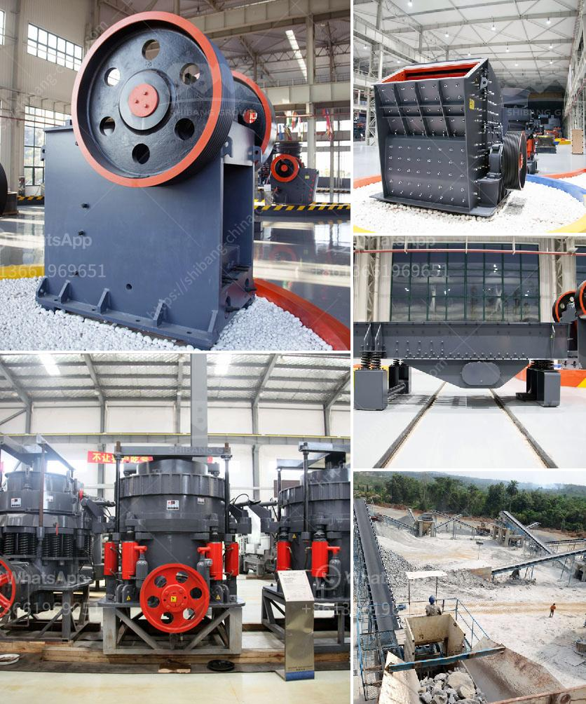

<h3>barite grinding machine germany</h3>
Barite, also known as baryte, is a mineral commonly found in nature. It has a high specific gravity and is often used in drilling muds, pigments, and as a weighting agent in various industries. To process barite efficiently, grinding machines are crucial.

Germany is a leading producer of barite worldwide, and its extensive mining resources have been exploited for decades. Furthermore, the country's expertise in machinery and equipment manufacturing makes it an ideal location for developing efficient grinding machines.

Barite grinding machines in Germany have the distinct advantage of being flexible in terms of processing. They can be easily adjusted to accommodate a variety of specifications, ensuring a highly precise final product. This adaptability is crucial, as barite is used in a wide range of industries, including oil and gas drilling, painting and coating, plastics, and pharmaceuticals, among others.

The barite grinding machines in Germany are equipped with advanced precision technologies, such as pneumatic clamping system, automatic lubrication, and remote control operation. These features contribute to the overall productivity and efficiency of the grinding process.

Moreover, the grinding machines are designed with a robust structure and high-quality components to ensure their longevity and minimal maintenance requirements. This makes them a cost-effective investment for companies looking to optimize their barite processing operations.

Germany's strong industrial sector, with its emphasis on innovation and technological advancements, facilitates the continuous improvement of barite grinding machines. This translates into higher productivity, improved grinding capabilities, and enhanced product quality. German manufacturers are also known for their commitment to environmental sustainability, ensuring that the grinding machines adhere to the highest standards of energy efficiency and waste reduction.

In conclusion, Germany's expertise in machinery manufacturing and its vast barite resources make it an ideal location for producing high-quality grinding machines. These machines are essential for efficiently processing barite in various industries and offer the flexibility to meet specific requirements. With their advanced technologies and robust structures, barite grinding machines from Germany are a reliable and cost-effective solution for companies worldwide.
<h3>Contact us</h3><ul><li><strong>Whatsapp:&nbsp;<a href="https://wa.me/8613661969651">+8613661969651</a></strong></li><li><a href="https://swt.shibang-china.com/?git&amp;zhl&amp;barite grinding machine germany"><strong>Online Service(chat now)</strong></a></li></ul><h3>Related</h3><ul><li><a href='crusher for sale in kenya.md'>crusher for sale in kenya</a></li><li><a href='sand making plant china.md'>sand making plant china</a></li><li><a href='talcum powder grinding machine in kerala.md'>talcum powder grinding machine in kerala</a></li><li><a href='rock crushing cone.md'>rock crushing cone</a></li><li><a href='calcium powder plant.md'>calcium powder plant</a></li></ul>