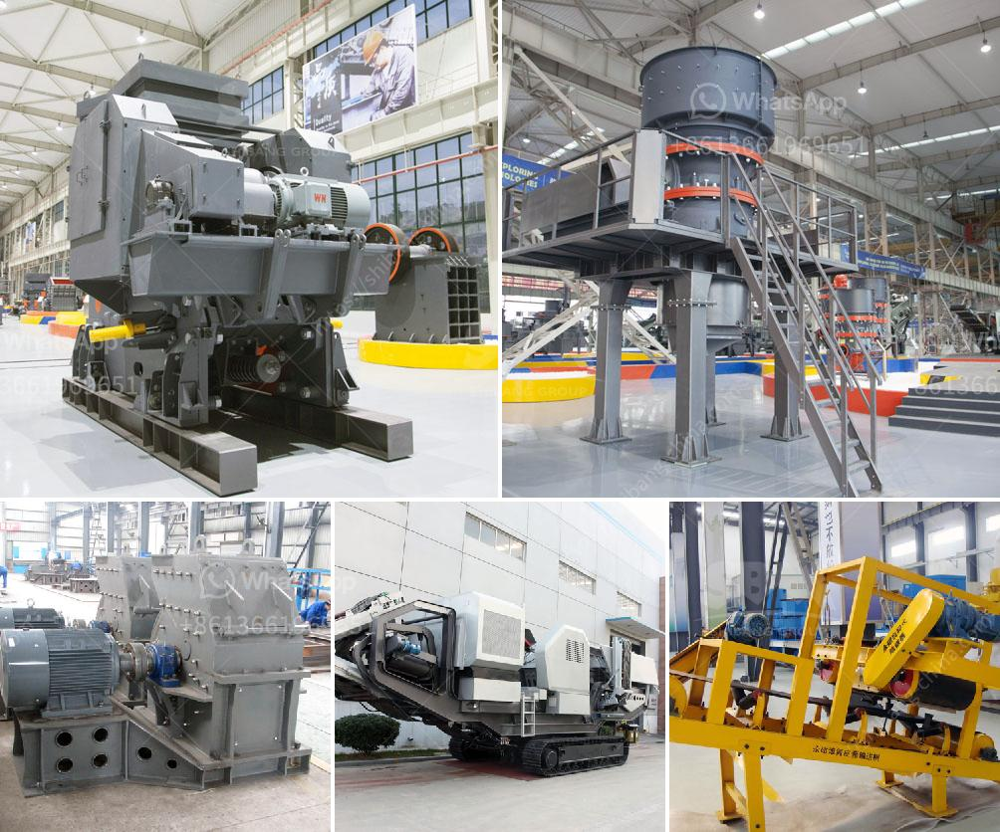

<h3>barite grinding machine manufacturer</h3>
Barite is a mineral composed of barium sulfate (BaSO4). It is usually colorless or milky white, but can also appear in shades of green, yellow, or even red. Barite is commonly used in various industries, such as oil and gas, drilling fluids, pharmaceuticals, paint and coatings, and rubber. Due to its wide range of applications, the demand for barite has been steadily increasing.

To meet the growing demand for barite, grinding machines have become essential in the mineral processing industry. The grinding process of barite is achieved by crushing, grinding, and classifying. Depending on the final usage, grinding mills can be divided into several categories, including Raymond mill, high-pressure suspension mill, ultrafine grinding mill, and European grinding mill. Barite grinding machine manufacturer, Guilin Hongcheng Mining Equipment Manufacturing Co., Ltd. is a professional grinding machine manufacturer with rich experience in barite grinding.

With the development of barite market, more and more customers have gradually increased the demand for barite grinding mill. Hongcheng has rich experience in processing barite and provides professional barite grinding solutions. The newly upgraded Raymond mill machine can be used in barite grinding with a production capacity increased by more than 40% and a unit power consumption cost reduced by more than 30%. It is a new generation of upgraded environmental protection mill equipment. Moreover, YoungVert is a vertical roller mill designed and manufactured by Hongcheng. It adopts high-temperature calcination technology to improve the whiteness and fineness of barite powder. The whiteness can be increased by 20-30% and the fineness from 325 to 2500 mesh.

As a professional grinding machine manufacturer, Hongcheng has a strong R&D team, specializing in the research and development of barite grinding machine. The advanced technology and excellent performance of Hongcheng's grinding machines have been widely recognized and praised by customers. In addition, Hongcheng provides customized services according to customers' needs, and its after-sales service is timely and efficient.

Moreover, Hongcheng's grinding machines have been exported to over 100 countries and regions around the world, with a good reputation and high customer satisfaction. The company adheres to the principle of "quality first, service first", and continuously improves the quality and performance of its products to meet customer requirements.

In conclusion, as a professional barite grinding machine manufacturer, Hongcheng provides customers with high-quality grinding machines and complete grinding solutions. With advanced technology, excellent performance, and comprehensive after-sales service, Hongcheng has won the trust and loyalty of customers worldwide. If you are looking for a reliable and efficient barite grinding machine manufacturer, Hongcheng is your best choice.
<h3>Contact us</h3><ul><li><strong>Whatsapp:&nbsp;<a href="https://wa.me/8613661969651">+8613661969651</a></strong></li><li><a href="https://swt.shibang-china.com/?git&amp;zhl&amp;barite grinding machine manufacturer"><strong>Online Service(chat now)</strong></a></li></ul><h3>Related</h3><ul><li><a href='india sand crusher.md'>india sand crusher</a></li><li><a href='clay mill machine crusher price.md'>clay mill machine crusher price</a></li><li><a href='price for stone crusher.md'>price for stone crusher</a></li><li><a href='calcite grinding mill.md'>calcite grinding mill</a></li><li><a href='the gold mining process in zimbabwe.md'>the gold mining process in zimbabwe</a></li></ul>