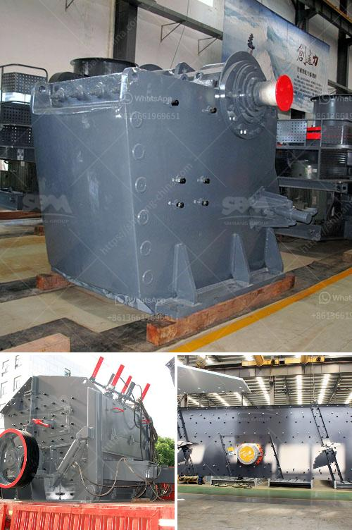

<h3>barytes pulverizer equipment</h3>
Barytes pulverizer equipment is a versatile and economical solution for processing barytes. It provides a high-quality powder with a consistent particle size distribution, making it ideal for a wide range of applications including oil and gas drilling, paint and pigment production, and industrial coatings.

Barytes, also known as barite, is a naturally occurring mineral that is primarily composed of barium sulfate (BaSO4). It is widely used in various industries due to its high specific gravity, chemical inertness, and low solubility in water. Barytes is typically ground into a fine powder before being used, and this is where the barytes pulverizer equipment comes into play.

The barytes pulverizer equipment consists of a series of grinding mills, which grind barytes into a powder with a specific particle size distribution. The size of the final powder can be adjusted by changing the speed and size of the grinding mills. The mills are typically operated in a closed circuit, with a separator that keeps oversized particles from being returned to the mills.

One of the key advantages of barytes pulverizer equipment is its efficiency. The grinding mills are designed to minimize energy consumption while maximizing the throughput of barytes. This means that more barytes can be processed in less time, leading to higher productivity and lower operating costs.

Another advantage of barytes pulverizer equipment is its versatility. The equipment can handle a wide range of feed materials, including both wet and dry barytes. This flexibility allows for easy integration into existing processing plants and enables manufacturers to process various grades of barytes to meet the specific requirements of different industries.

In addition to its efficiency and versatility, barytes pulverizer equipment also offers superior product quality. The grinding mills are designed to produce a powder with a consistent particle size distribution, ensuring that each particle has the same size and shape. This is crucial for applications where the powder's properties, such as its dispersibility, are critical for the final product's performance.

Moreover, the barytes pulverizer equipment is designed for easy maintenance and operation. It features a rugged construction that can withstand the demands of continuous operation, minimizing downtime for maintenance and repairs. The equipment is also equipped with advanced control systems that allow for precise adjustment of process parameters, ensuring optimal performance and product quality.

In conclusion, barytes pulverizer equipment is a valuable asset for processing barytes in various industries. Its efficiency, versatility, and superior product quality make it an essential tool for manufacturers looking to improve their production processes. Whether it is for oil and gas drilling, paint and pigment production, or industrial coatings, barytes pulverizer equipment offers a reliable and cost-effective solution for processing barytes.
<h3>Contact us</h3><ul><li><strong>Whatsapp:&nbsp;<a href="https://wa.me/8613661969651">+8613661969651</a></strong></li><li><a href="https://swt.shibang-china.com/?git&amp;zhl&amp;barytes pulverizer equipment"><strong>Online Service(chat now)</strong></a></li></ul><h3>Related</h3><ul><li><a href='calcium powder plant.md'>calcium powder plant</a></li><li><a href='iron ore upgrading plant equipment.md'>iron ore upgrading plant equipment</a></li><li><a href='price phosphate rock crusher.md'>price phosphate rock crusher</a></li><li><a href='machine for gypsum factory from philippines.md'>machine for gypsum factory from philippines</a></li><li><a href='silica powder grinding machine.md'>silica powder grinding machine</a></li></ul>