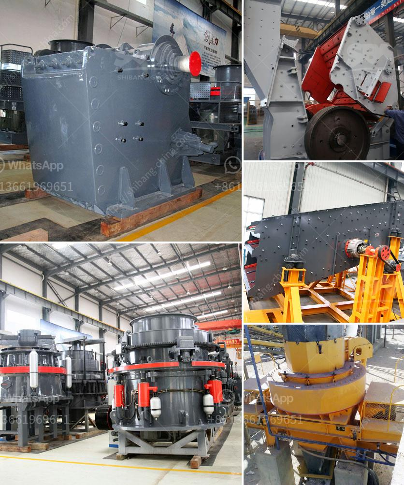

<h3>basalt curb stone crusher price</h3>
Basalt is a common stone material in the construction industry. It is widely used for its excellent properties, such as resistance to corrosion, acid and alkali, resistance to compression, good wear resistance and low water absorption. Therefore, it has become the preferred material for curbing stones in roads, sidewalks, and garden landscapes. The demand for basalt curb stones is on the rise, which has also led to an increase in the prices of crushers used in the mining industry.

Basalt curb stone crushers are commonly used in crushing operations in mining factories, construction sites and cement industries. Due to the high hardness of basalt, it is necessary to select crushers with good wear resistance to meet the processing requirements of basalt. There are two types of impact crushers and jaw crushers available for the production of basalt curb stones.

The impact crusher is suitable for basalt crushing operations, with advantages such as high crushing efficiency, low wear and tear, and good safety performance. The finished product has a uniform particle size, and good granular shape, which is an ideal choice for secondary crushing. However, the price of impact crusher is relatively higher, which limits the application of this type of crusher.

On the other hand, the jaw crusher is suitable for primary crushing of basalt stones. It has a large crushing ratio and can crush large chunks of basalt into smaller pieces. The jaw crusher has a simple structure, stable operation, high crushing efficiency, low investment cost, good wear resistance of wearing parts, and low maintenance cost. Therefore, it is widely used in basalt processing.

The price of basalt curb stone crushers varies from tens of thousands to hundreds of thousands. What factors affect the price of basalt curb stone crushers? Let's take a look at the following aspects:

1. Production Cost: The production cost of crushers includes the cost of raw materials, equipment, electricity, and labor. Different regions and manufacturers have different production costs, which directly affects the price of crushers.

2. Market Demand: The supply and demand in the market also affect the price of basalt curb stone crushers. If the supply exceeds the demand, the price will be relatively low. Conversely, if the demand exceeds the supply, the price will be relatively high.

3. Brand and Reputation: Crushers from well-known brands or manufacturers with a good reputation generally have higher prices. This is because they have been recognized by the market for their product quality and service, and customers are willing to pay a higher price for them.

4. Configuration and Model: Crushers with different configurations and models have different prices. Crushers with larger specifications and higher output are generally more expensive.

In conclusion, the price of basalt curb stone crushers is influenced by various factors such as production cost, market demand, brand and reputation, and configuration and model. It is recommended that customers compare different suppliers and models, consider their own production needs and budgets, and choose the most suitable crusher with a reasonable price-performance ratio.
<h3>Contact us</h3><ul><li><strong>Whatsapp:&nbsp;<a href="https://wa.me/8613661969651">+8613661969651</a></strong></li><li><a href="https://swt.shibang-china.com/?git&amp;zhl&amp;basalt curb stone crusher price"><strong>Online Service(chat now)</strong></a></li></ul><h3>Related</h3><ul><li><a href='ball mills prices.md'>ball mills prices</a></li><li><a href='belt conveyor supplier in china.md'>belt conveyor supplier in china</a></li><li><a href='stone crusher used machinery for sale in india.md'>stone crusher used machinery for sale in india</a></li><li><a href='ball mill hammer.md'>ball mill hammer</a></li><li><a href='crusher for sale kenya.md'>crusher for sale kenya</a></li></ul>