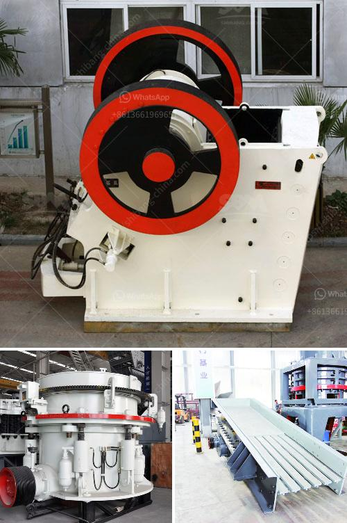

<h3>basalt production process</h3>
Basalt is a hard, dense volcanic rock that is widely used in a variety of applications. Its versatility and durability make it an ideal material for construction, landscaping, and manufacturing purposes. The production of basalt involves several steps, from quarrying to fabrication, each contributing to the overall quality and integrity of the final product.

The first step in the basalt production process is quarrying. Large blocks of basalt rock are extracted from the earth's crust through explosive blasting or mechanical excavation techniques. These blocks are then transported to the processing facility for further refinement.

Upon arrival at the processing facility, the basalt blocks are carefully inspected for any visible defects or impurities. Any unwanted material is removed, ensuring that only high-quality basalt is used in the production process. This selective extraction guarantees the end product's consistency and strength.

Next, the basalt blocks undergo cutting or shaping. Large saws equipped with diamond-tipped blades are used to slice the blocks into slabs or rectangular shapes according to customers' specifications. This process requires precision and expertise to ensure accurate dimensions and smooth surfaces.

Once the basalt blocks are cut or shaped, they are prepared for further processing. The slabs or shapes are conveyed into a drying chamber, where any excess moisture or water is eliminated. This step is crucial as it prevents potential structural damage and ensures the adhesive properties of subsequent steps.

After drying, the basalt slabs are polished to achieve a smooth and lustrous finish. Polishing machines equipped with abrasive pads are utilized in this process. As the slabs pass through the polishing machine, the abrasive pads gradually remove any imperfections, scratches, or roughness, resulting in a glossy appearance.

In some cases, additional treatments may be applied to the basalt slabs to enhance their aesthetics or functional properties. These treatments may include sealants, surface coatings, or color enhancements. The choice of such treatments depends on the intended use and design preferences of the end user.

Finally, the finished basalt slabs or shapes are inspected for quality assurance. Experienced technicians examine each piece to ensure it meets the desired standards for thickness, texture, color, and overall appearance. Only after passing this inspection are the basalt products approved for packaging and distribution.

It is worth noting that this production process can vary slightly between manufacturers and locations. However, the general steps involved remain consistent throughout the industry. The focus on quality control and attention to detail at each stage guarantees that the final basalt product meets or exceeds customers' expectations.

In conclusion, the production of basalt involves several meticulous and systematic steps, ensuring the highest quality and performance of the end product. From quarrying to fabrication, these processes require expertise, precision, and careful inspection to create durable and attractive basalt materials. The result is a versatile and sustainable resource that is widely utilized in various industries, contributing to the advancement of infrastructure and design.
<h3>Contact us</h3><ul><li><strong>Whatsapp:&nbsp;<a href="https://wa.me/8613661969651">+8613661969651</a></strong></li><li><a href="https://swt.shibang-china.com/?git&amp;zhl&amp;basalt production process"><strong>Online Service(chat now)</strong></a></li></ul><h3>Related</h3><ul><li><a href='gravel and sand supply business plan pdf.md'>gravel and sand supply business plan pdf</a></li><li><a href='quartz plants for sale.md'>quartz plants for sale</a></li><li><a href='the weight of stone crusher.md'>the weight of stone crusher</a></li><li><a href='formato de la planta de trituracion de mantenimiento.md'>formato de la planta de trituracion de mantenimiento</a></li><li><a href='list of used machines coal mining.md'>list of used machines coal mining</a></li></ul>