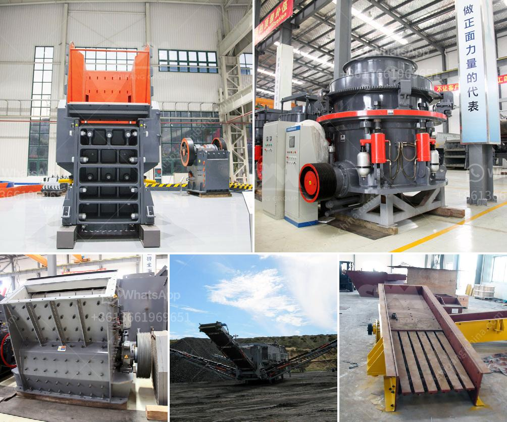

<h3>basalt quarry equipments</h3>
Basalt is a common igneous rock formed from the rapid cooling of basaltic lava. It is the predominant material found in volcanic regions around the world, including the Mid-Atlantic Ridge and Hawaii. Due to its durability and aesthetic appeal, basalt has become a sought-after material for construction and landscaping purposes. But how is this valuable rock extracted from the earth? In this article, we will take a closer look at the essential equipment used in basalt quarrying.

First and foremost, any quarry operation requires heavy machinery to remove large blocks of stone from the earth. Excavators and loaders are commonly used in basalt quarries due to their ability to handle the large volumes of materials involved. Excavators, with their powerful hydraulic systems and buckets, can easily remove the overburden and expose the basalt deposits. Loaders, on the other hand, are used to efficiently transport the extracted basalt to processing areas or storage facilities.

To break down the large blocks of basalt into smaller, more manageable pieces, crushers are an indispensable piece of equipment. Crushers are often used in quarries to crush the extracted stone into specific sizes suitable for various applications. There are several types of crushers commonly used in basalt quarrying, including jaw crushers, cone crushers, impact crushers, and gyratory crushers.

Once the basalt has been crushed, it may need to be further processed to meet specific requirements. This is where screening equipment comes into play. Screening equipment is used to separate the crushed basalt into different sizes and remove any unwanted materials. Vibrating screens, for instance, are commonly used to sort the crushed basalt by size, ensuring uniformity in the final product.

Moving on to the transportation aspect, a variety of vehicles and conveyors make the process flow smoothly in a basalt quarry. Dump trucks are frequently used to transport the extracted rock to processing facilities, while conveyor belts enable the seamless transfer of basalt between different stages of the quarrying process. Additionally, specialized trucks equipped with crane arms or hydraulic grabs are used to move and load the processed basalt onto transportation vehicles for delivery to customers.

Finally, it is worth mentioning the importance of safety equipment in any quarry operation. Quarrying can be a hazardous job, and ensuring the well-being of workers is paramount. Personal protective equipment (PPE) such as hard hats, safety boots, goggles, and high-visibility clothing are essential for all quarry workers. Additionally, dust control measures, such as dust suppression systems or water sprays, should be implemented to minimize the health risks associated with the inhalation of particles.

In conclusion, basalt quarrying requires an array of heavy machinery and equipment to extract, crush, screen, transport, and process the valuable rock. From excavators and crushers to vibrating screens and conveyors, each piece of equipment plays a crucial role in ensuring the efficient and safe operation of a basalt quarry. By employing the right tools and machinery, quarry operators can meet the demand for basalt and deliver high-quality products for various construction and landscaping purposes.
<h3>Contact us</h3><ul><li><strong>Whatsapp:&nbsp;<a href="https://wa.me/8613661969651">+8613661969651</a></strong></li><li><a href="https://swt.shibang-china.com/?git&amp;zhl&amp;basalt quarry equipments"><strong>Online Service(chat now)</strong></a></li></ul><h3>Related</h3><ul><li><a href='setting up limestone processing plant in nigeria.md'>setting up limestone processing plant in nigeria</a></li><li><a href='limestone powder making plant ireland.md'>limestone powder making plant ireland</a></li><li><a href='list mines and quarry owners of malaysia.md'>list mines and quarry owners of malaysia</a></li><li><a href='deisel hammer mill in south africa.md'>deisel hammer mill in south africa</a></li><li><a href='quarrying crusher in zimbia.md'>quarrying crusher in zimbia</a></li></ul>