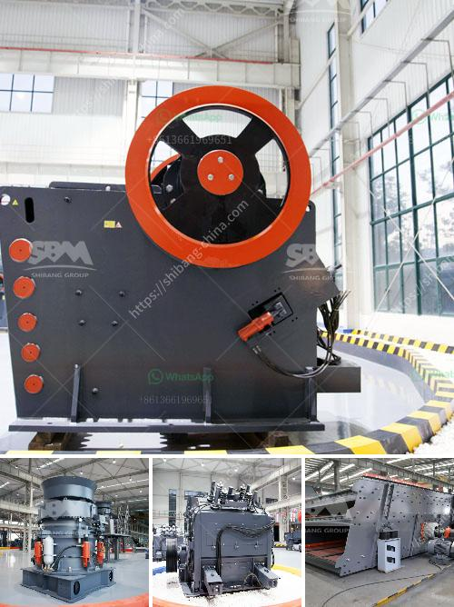

<h3>bauxite processing plant in taitata</h3>
The town of Taitata, nestled in the heart of a mesmerizing natural landscape, is set to become a prominent hub for the extraction and processing of bauxite. This transformation is primarily due to the establishment of a state-of-the-art bauxite processing plant in the region. This new facility is set to revolutionize the local economy, provide employment opportunities, and uplift the overall standard of living for the people of Taitata.

Bauxite, an abundant mineral found in several parts of the world, is the main source of aluminum. It is a key ingredient in the production of various essential items, including kitchenware, beverages cans, airplane parts, and building materials. With the rising demand for aluminum, the establishment of the bauxite processing plant in Taitata is a strategic move that guarantees a steady supply of this valuable mineral.

The processing plant, equipped with cutting-edge technology and advanced machinery, is capable of extracting bauxite from the earth efficiently. The ore is then meticulously processed to remove impurities and increase its aluminum content. The purified bauxite is subsequently sent for further refining and smelting, eventually leading to the creation of high-quality aluminum.

The plant's presence in Taitata is already making a significant impact on the local economy. The project has generated numerous job opportunities for the residents, catering to a wide range of roles ranging from extraction and processing to administrative and managerial positions. The influx of employment has spurred economic growth, with businesses experiencing increased demand and consumer spending.

Moreover, the bauxite processing plant has fostered local development by providing infrastructural support in the region. The surrounding areas now have access to better roads, electricity, and water supply, improving the overall quality of life for the residents of Taitata. Additionally, the project has invested in health and education initiatives, ensuring the wellbeing and growth of the local community.

The establishment of the bauxite processing plant in Taitata is not only a testament to the region's natural resource potential but also a milestone in its economic development. As the plant continues its operations, it is expected to further contribute to sustainable growth, innovation, and prosperity in the area. Taitata is now firmly positioned on the global map as a key player in the bauxite industry, shaping a brighter future for its people.
<h3>Contact us</h3><ul><li><strong>Whatsapp:&nbsp;<a href="https://wa.me/8613661969651">+8613661969651</a></strong></li><li><a href="https://swt.shibang-china.com/?git&amp;zhl&amp;bauxite processing plant in taitata"><strong>Online Service(chat now)</strong></a></li></ul><h3>Related</h3><ul><li><a href='stone crusher application.md'>stone crusher application</a></li><li><a href='crusher plant design.md'>crusher plant design</a></li><li><a href='sand manufacturing machine price in tamilnadu.md'>sand manufacturing machine price in tamilnadu</a></li><li><a href='second hand diamond dms plant for sale kimberly.md'>second hand diamond dms plant for sale kimberly</a></li><li><a href='cement production machinery.md'>cement production machinery</a></li></ul>