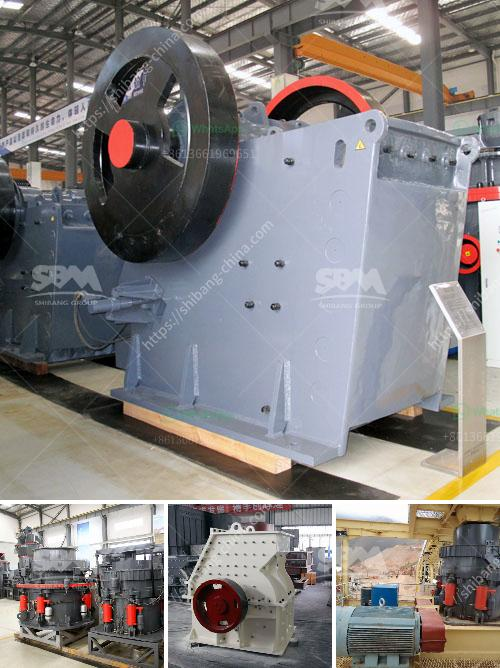

<h3>bauxite screening machine</h3>
Bauxite is a mineral and the main ore of aluminum. It is formed in weathered volcanic rocks and found in richly forested, humid, tropical climate areas. Bauxite mining involves several processes including blasting, drilling, crushing, screening, and conveying. The extracted ore is then refined into alumina, which is further processed to produce aluminum. 

One of the crucial steps in bauxite processing is the screening of bauxite ore. It is performed to remove oversized and undersized particles from the ore, ensuring a consistent particle size distribution for subsequent processing. To accomplish efficient and accurate screening, a bauxite screening machine is deployed.

A bauxite screening machine is designed to perform precise screening operations while minimizing vibrations and maximizing throughput. These machines use a combination of mechanical and vibratory screening mechanisms to achieve the desired separation of bauxite particles.

Mechanical screening involves using a screen to separate the particles based on their size. The screen consists of a mesh or perforated plate with specific openings that allow only particles of a certain size to pass through. Oversized particles are retained on the screen surface and discharged as reject. The size of the openings determines the cut point, which can be adjusted to achieve the desired separation. 

Vibratory screening, on the other hand, relies on the principle of natural frequency. An eccentric weighted shaft excites the screen surface, causing it to vibrate at a specific frequency. This vibration helps separate the particles by size as they move along the screen surface. The larger particles tend to move ahead of the smaller ones, resulting in effective screening.

Bauxite screening machines are available in various configurations, including horizontal screens, inclined screens, and multi-deck screens. Horizontal screens are ideal for high-capacity screening, as they provide a wide screening surface area. Inclined screens are suitable for smaller feed rates and have an adjustable inclination angle to optimize the screening process. Multi-deck screens, as the name suggests, consist of multiple decks stacked on top of each other, allowing for multiple separations in a single pass.

Besides accurate screening, bauxite screening machines should also be durable, reliable, and easy to maintain. They are exposed to harsh mining environments, including dust, moisture, and abrasive materials, which can cause wear and tear. Robust construction, high-quality materials, and advanced sealing technologies are incorporated to ensure their longevity in such conditions. Additionally, user-friendly designs and accessible components facilitate maintenance and minimize downtime.

The proper functioning of a bauxite screening machine is essential for the overall efficiency of the bauxite processing plant. An optimized screening process ensures a consistent feed to the next stages of the process, such as crushing and grinding, leading to increased productivity and reduced operational costs. Therefore, investing in a reliable bauxite screening machine is crucial for bauxite producers.

In conclusion, bauxite screening machines play a vital role in the overall bauxite processing process. They ensure accurate separation of bauxite particles, improving the efficiency and productivity of the processing plant. With the appropriate selection and proper maintenance, bauxite screening machines can contribute to the success of bauxite mining operations by delivering consistent and high-quality ore.
<h3>Contact us</h3><ul><li><strong>Whatsapp:&nbsp;<a href="https://wa.me/8613661969651">+8613661969651</a></strong></li><li><a href="https://swt.shibang-china.com/?git&amp;zhl&amp;bauxite screening machine"><strong>Online Service(chat now)</strong></a></li></ul><h3>Related</h3><ul><li><a href='roller crusher on sale.md'>roller crusher on sale</a></li><li><a href='mobile cil gold processing plant.md'>mobile cil gold processing plant</a></li><li><a href='production process of calcium carbonate.md'>production process of calcium carbonate</a></li><li><a href='mobile crushing plant in peru.md'>mobile crushing plant in peru</a></li><li><a href='grinding machine specification india price.md'>grinding machine specification india price</a></li></ul>