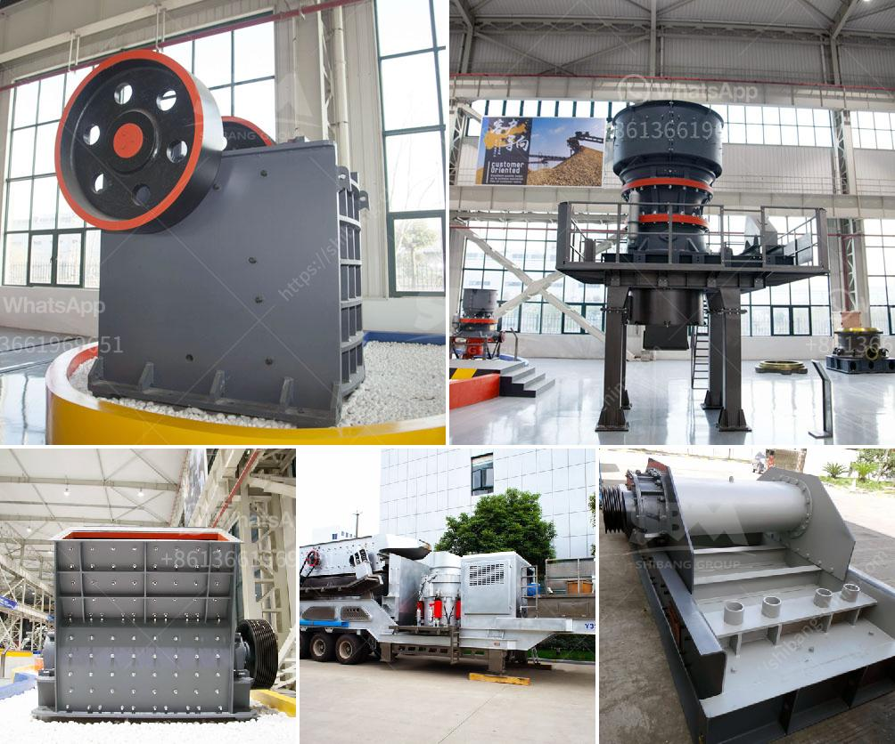

<h3>belt conveyor belt suppliers in oman</h3>
Modern industries are heavily dependent on efficient transportation systems for their operations. The ability to smoothly and safely transport materials from one point to another is crucial for maintaining productivity and reducing operational costs. Among the various transportation methods available, belt conveyors are widely regarded as one of the most reliable and cost-effective solutions.

In the Sultanate of Oman, belt conveyor systems are extensively used to facilitate the movement of bulk materials within industries such as mining, food processing, and logistics. The conveyor belts are vital components in ensuring the seamless flow of goods and materials, maximizing productivity and improving overall operational efficiency.

To meet the growing demand for belt conveyor belts in Oman, there has been a significant development in the number of suppliers. These suppliers play a crucial role in offering high-quality conveyor belts that are capable of withstanding the harsh conditions prevalent in industries.

One such renowned supplier is XYZ Conveyor Belts. With their extensive experience and expertise in the field, they have become a trusted partner for various industries in Oman. They supply a wide range of conveyor belts tailored to meet the specific needs of different industries.

One of the key factors that set apart XYZ Conveyor Belts from others is their commitment to providing premium quality belts that last long even in challenging environments. Conveyor belts used in industries like mining are exposed to heavy loads, extreme temperatures, and abrasive materials on a daily basis. To address these challenges, XYZ Conveyor Belts offers belts made from top-grade materials that are resistant to wear and tear, abrasion, and excessive heat.

Additionally, XYZ Conveyor Belts also ensures that their belts are designed and manufactured to meet international standards and safety regulations. This ensures that their customers in Oman receive conveyor belts that are not only durable but also safe to use, preventing accidents and workplace hazards.

Another advantage of XYZ Conveyor Belts is their ability to provide customized solutions. Different industries have different requirements when it comes to conveyor belts. Understanding this, XYZ Conveyor Belts works closely with their customers to understand their unique needs and design conveyor belts that perfectly suit their applications. From determining the ideal belt width and thickness to incorporating specific features like cleats or sidewalls, XYZ Conveyor Belts ensures that their belts are customized to enhance efficiency and performance.

To further support their customers, XYZ Conveyor Belts offers comprehensive after-sales services in Oman. This includes regular maintenance and inspections, timely repairs, and the availability of genuine spare parts. With these services in place, XYZ Conveyor Belts ensures that their customers' conveyor belts always function optimally, minimizing downtime and maximizing productivity.

In conclusion, belt conveyor belt suppliers in Oman play a crucial role in supporting the numerous industries that rely on efficient material transportation. XYZ Conveyor Belts, with their commitment to quality, safety, customization, and after-sales services, stands out as a reliable and trusted supplier. Their durable conveyor belts are capable of withstanding the demanding conditions prevalent in industries, ensuring smooth and efficient material flow. By partnering with such suppliers, industries in Oman can optimize their operations, minimize costs, and enhance overall productivity.
<h3>Contact us</h3><ul><li><strong>Whatsapp:&nbsp;<a href="https://wa.me/8613661969651">+8613661969651</a></strong></li><li><a href="https://swt.shibang-china.com/?git&amp;zhl&amp;belt conveyor belt suppliers in oman"><strong>Online Service(chat now)</strong></a></li></ul><h3>Related</h3><ul><li><a href='setting up of a stone quarry plant in nigeria.md'>setting up of a stone quarry plant in nigeria</a></li><li><a href='set up a quarry for ballast stones south africa.md'>set up a quarry for ballast stones south africa</a></li><li><a href='crusher machine supplier malaysia.md'>crusher machine supplier malaysia</a></li><li><a href='how much does gold mining licences in nigeria.md'>how much does gold mining licences in nigeria</a></li><li><a href='crushing and screening of manganese ore.md'>crushing and screening of manganese ore</a></li></ul>