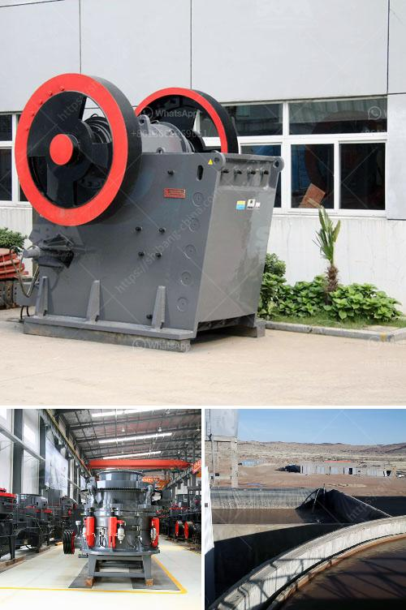

<h3>belt conveyor for stone aggregate</h3>
A belt conveyor is an indispensable tool in any construction site as it aids in the efficient transportation of large amounts of stone aggregate. These materials are essential for the construction industry and play a vital role in the development of infrastructure projects such as roads, bridges, and buildings. Typically, stone aggregate is transported from the quarrying site to the construction site using belt conveyors, which offer numerous benefits and advantages.

One of the primary advantages of using belt conveyors for stone aggregate is the ability to transport materials over long distances. Conveyor belts can span several kilometers, facilitating the movement of stone aggregate from the quarrying site to the construction area. This eliminates the need for multiple trips, reducing transportation costs and improving overall efficiency.

Furthermore, belt conveyors are highly customizable and can be tailored to the specific requirements of a project. They can be designed to navigate challenging terrains, such as hilly areas or uneven surfaces, with ease. This flexibility makes them suitable for a wide range of construction projects, regardless of the topography of the site.

Another advantage of utilizing belt conveyors is the ability to control the speed at which materials are transported. The conveyor belts can be adjusted to accommodate the desired flow rate, ensuring a steady supply of stone aggregate at the construction site. This control over the transportation speed enhances productivity and enables construction projects to stay on schedule.

Safety is also a crucial aspect of any construction site, and belt conveyors provide significant safety benefits. By automating the transportation process, they reduce the need for manual handling of heavy materials, reducing the risk of accidents and injuries. Additionally, the use of conveyor belts minimizes the chances of material spillage, ensuring a cleaner and safer work environment.

Maintenance and upkeep of belt conveyors are relatively straightforward, making them cost-effective in the long run. Regular inspections and preventive maintenance help identify any potential issues and prevent costly breakdowns. Well-maintained conveyor belts also have a longer lifespan, resulting in reduced replacement and repair costs.

In terms of sustainability, belt conveyors are an environmentally friendly option. They minimize the need for fossil fuel-powered vehicles, reducing carbon emissions and air pollution. Additionally, conveying material through a belt conveyor system consumes much less energy compared to other transportation methods, making them a more sustainable choice for aggregate transportation.

In conclusion, belt conveyors are essential equipment for the efficient transportation of stone aggregate in construction projects. They offer numerous advantages, including long-distance transportation capabilities, adaptability to various terrains, and control over the transportation speed. Additionally, they improve safety on construction sites, require minimal maintenance, and are environmentally friendly. By utilizing belt conveyors, construction companies can optimize their operations, reduce costs, enhance productivity, and contribute to a more sustainable future in the construction industry.
<h3>Contact us</h3><ul><li><strong>Whatsapp:&nbsp;<a href="https://wa.me/8613661969651">+8613661969651</a></strong></li><li><a href="https://swt.shibang-china.com/?git&amp;zhl&amp;belt conveyor for stone aggregate"><strong>Online Service(chat now)</strong></a></li></ul><h3>Related</h3><ul><li><a href='dolamite powder machine.md'>dolamite powder machine</a></li><li><a href='cebu supplier of disposable jaw crusher.md'>cebu supplier of disposable jaw crusher</a></li><li><a href='crushing machine manufacturers cape town.md'>crushing machine manufacturers cape town</a></li><li><a href='used small gold processing plant from dubai.md'>used small gold processing plant from dubai</a></li><li><a href='stone quarry equipment.md'>stone quarry equipment</a></li></ul>