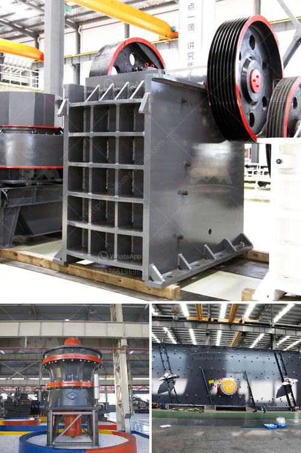

<h3>belt conveyor supplier in china</h3>
In recent years, the manufacturing industry in China has been thriving, leading to a growing demand for various types of equipment and machinery. One such essential equipment used in industries like mining, agriculture, and logistics is the belt conveyor. A belt conveyor plays a crucial role in automated production processes by efficiently transporting materials or products from one point to another. As the demand for belt conveyors increases, finding a reliable supplier becomes essential. This article aims to explore the importance of choosing a reliable belt conveyor supplier in China.

One of the primary reasons to choose a belt conveyor supplier in China is the country's reputation as the manufacturing hub of the world. China has a vast number of suppliers offering a wide range of belt conveyors with different specifications and features to meet various industry needs. The sheer number of suppliers ensures that customers have access to a broad selection of options and can find the conveyor that best fits their requirements.

Moreover, Chinese belt conveyor suppliers are known for their competitive pricing. China's manufacturing industry benefits from economies of scale, allowing suppliers to offer products at competitive prices compared to suppliers from other countries. This affordability is a significant advantage for businesses looking to reduce costs without compromising on the quality of the equipment.

Quality is another crucial factor when choosing a belt conveyor supplier, and Chinese suppliers have made significant progress in this aspect. Many Chinese suppliers are now ISO certified, ensuring adherence to international quality standards. Additionally, suppliers leverage advanced manufacturing technologies and quality control processes to produce high-quality belt conveyors that are durable, reliable, and capable of withstanding heavy loads.

Chinese belt conveyor suppliers also provide excellent customer service and support. They understand that prompt after-sales service is essential for maintaining long-term relationships with customers. As a result, they offer warranty periods and efficient maintenance services to address any issues that may arise during the operation of the conveyor. The technical expertise possessed by suppliers aids in troubleshooting and resolving problems quickly, minimizing downtime and increasing productivity for businesses.

When selecting a belt conveyor supplier in China, it is essential to consider their experience and reputation. The supplier's experience reflects their expertise in manufacturing belt conveyors and their understanding of industry-specific requirements. Reputable suppliers have a track record of delivering quality products and have established themselves as reliable partners in the industry.

In conclusion, choosing a belt conveyor supplier in China offers numerous advantages. The country's manufacturing prowess provides access to a wide range of options at competitive prices. With an emphasis on quality and efficient customer service, Chinese suppliers ensure that businesses can rely on their equipment for seamless operations. By carefully considering the supplier's experience and reputation, businesses can find a reliable partner capable of meeting their specific needs.
<h3>Contact us</h3><ul><li><strong>Whatsapp:&nbsp;<a href="https://wa.me/8613661969651">+8613661969651</a></strong></li><li><a href="https://swt.shibang-china.com/?git&amp;zhl&amp;belt conveyor supplier in china"><strong>Online Service(chat now)</strong></a></li></ul><h3>Related</h3><ul><li><a href='mobile crushing and screening.md'>mobile crushing and screening</a></li><li><a href='used industrial dryer for sale in india.md'>used industrial dryer for sale in india</a></li><li><a href='equipment for gold mine tailings in ghana.md'>equipment for gold mine tailings in ghana</a></li><li><a href='calcium carbonate production plant.md'>calcium carbonate production plant</a></li><li><a href='grinding mills in pakistan.md'>grinding mills in pakistan</a></li></ul>