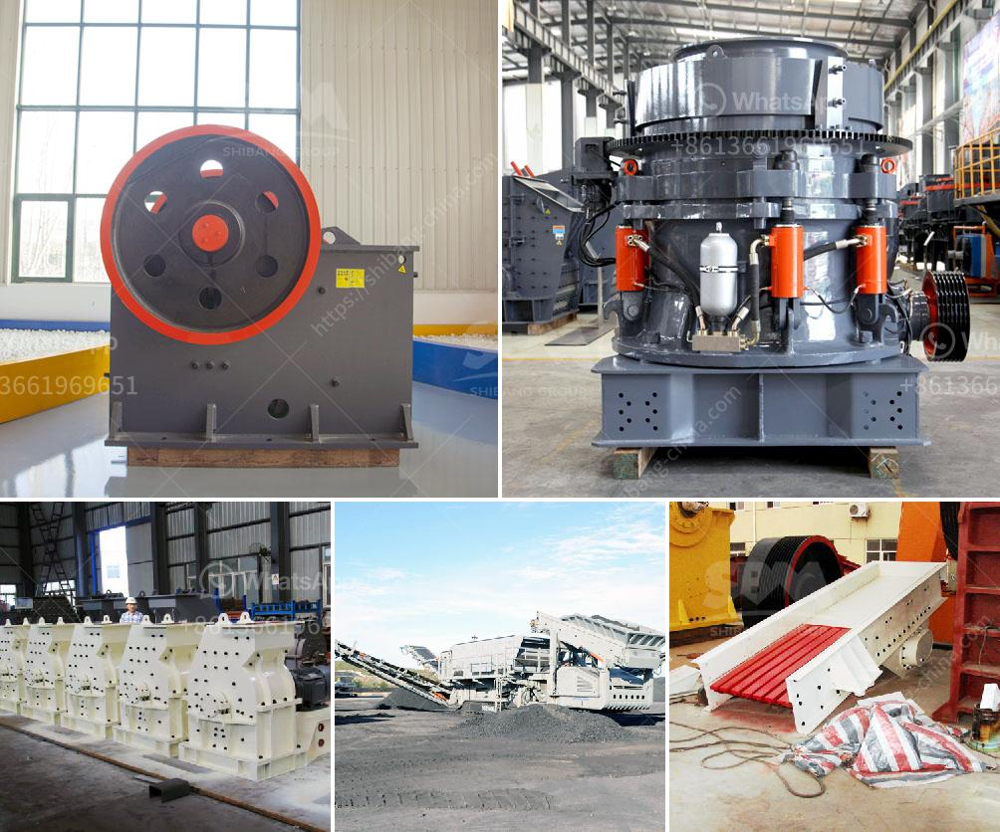

<h3>belt jaw crusher nigeria</h3>
Belt jaw crusher Nigeria is a pivotal crushing machine in the crushing industry, generally driven by the motor, belt jaw crusher Nigeria is characterized by its simple structure, easy operation, high crushing ratio and reliable performance, making it indispensable in the crushing process.

The jaw crusher machine consists of two jaw plates, the dynamic jaw and static jaw. The working principle of the jaw crusher depends on the periodic movement of the movable jaw plate to achieve the crushing process. The material is crushed and split into pieces when the movable jaw plate moves towards the fixed jaw plate, separating the materials into different sizes. Crushed materials will be discharged through the discharge opening.

The belt jaw crusher Nigeria is equipped with a simple structure, with large crushing ratio and high production efficiency. It is particularly suitable for crushing large and brittle materials, such as stone, coal, limestone, granite, iron ore, copper ore, gypsum, etc. The crusher machine can also be used in cement, metallurgy, chemical, electric power and other industries to grind all kinds of hard materials, and the maintenance is easy.

The belt jaw crusher Nigeria is mainly used in the industries of mining, metallurgy, building materials, highway, railway, water conservancy and chemical industries. It is widely used in various ores, sandstones, granite, limestone, quartzite, river pebbles, iron ore, copper ore, etc. The compressive strength is 320 MPa. It has the characteristics of large crushing ratio, simple structure, reliable operation, easy maintenance, and low operating cost.

In conclusion, the belt jaw crusher Nigeria is designed to handle hard, abrasive materials with minimal wear and tear. It functions without the need of regular lubrication, making it an ideal option for many businesses. The jaw crusher machine is used for crushing large-sized items into smaller particles, making them easier to handle and transport. If you are in need of a jaw crusher, you can consider buying one in Nigeria, as they are known for their high-quality products and competitive prices.
<h3>Contact us</h3><ul><li><strong>Whatsapp:&nbsp;<a href="https://wa.me/8613661969651">+8613661969651</a></strong></li><li><a href="https://swt.shibang-china.com/?git&amp;zhl&amp;belt jaw crusher nigeria"><strong>Online Service(chat now)</strong></a></li></ul><h3>Related</h3><ul><li><a href='deisel hammer mill in south africa.md'>deisel hammer mill in south africa</a></li><li><a href='ball crusher gold machine.md'>ball crusher gold machine</a></li><li><a href='granite stone quarrying equipment.md'>granite stone quarrying equipment</a></li><li><a href='aggregate crusher plants machinery.md'>aggregate crusher plants machinery</a></li><li><a href='used roller mill in kenya.md'>used roller mill in kenya</a></li></ul>