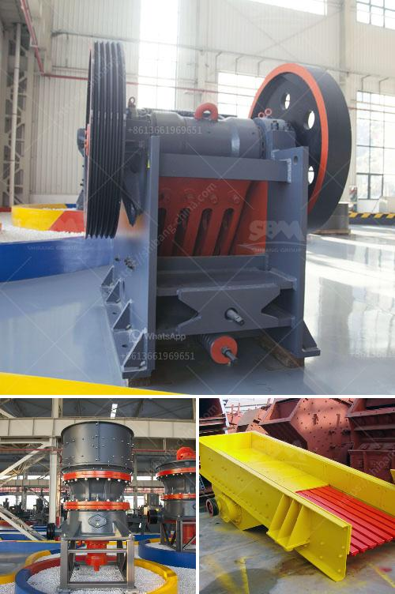

<h3>belt price conveyor belt price malaysia</h3>
Conveyor belts are widely used in various industries, including manufacturing, logistics, and mining. These belts are crucial in optimizing the overall efficiency of operations by effectively transporting goods and materials. If you are in the market for a conveyor belt in Malaysia, you may be wondering about the price.

To help you with your purchase, we have prepared this article providing you with useful insights into the cost of conveyor belts in Malaysia. We will discuss the factors influencing the pricing and provide you with a rough estimate to help you make an informed decision.

Firstly, it is important to understand that the price of a conveyor belt will vary depending on several factors. The most significant factor is the type of belt you require, as there are different types available for various applications. A few commonly used types of conveyor belts in Malaysia include spiral belts, magnetic belts, and steel belts.

The material used to construct the belt is another crucial aspect that affects its price. Conveyor belts can be made from various materials such as rubber, PVC, nylon, and polyester. The choice of material will depend on factors such as the type of goods being transported, the environment in which it will be used, and the required load-bearing capacity.

The length and width of the conveyor belt also impact the cost. Longer and wider belts will naturally be more expensive, as they require more material to manufacture. It is essential to accurately measure the required dimensions to obtain an accurate price quote.

Furthermore, additional features and accessories can contribute to the overall cost. Optional features such as cleats, sidewalls, and tracking guides may be necessary depending on the specific requirements of your operation. These enhancements can provide additional functionality, but also come at an additional cost.

Now let's dive into the actual pricing. To give you a rough estimate, a basic conveyor belt in Malaysia can cost anywhere between RM300 and RM500 per meter, depending on the aforementioned factors. However, depending on your requirements, the price can vary significantly, with high-end belts potentially costing upwards of RM1000 per meter.

It is also important to consider ongoing maintenance and replacement costs when budgeting for a conveyor belt. Over time, belts may experience wear and tear, requiring repairs or even total replacement. Hence, it is advisable to choose a reliable and durable belt that will minimize maintenance costs in the long run.

To find the best price for a conveyor belt in Malaysia, it is recommended to reach out to several suppliers and compare their offers. Consider factors such as product quality, warranty, after-sales support, and reputation in the industry. Investing in a high-quality belt from a reputable supplier may initially seem more expensive; however, it can save you money in the long run by reducing downtime and maintenance expenses.

In conclusion, the price of a conveyor belt in Malaysia can vary depending on factors like material, type, size, and additional features. It is crucial to accurately assess your requirements and budget to ensure you select the right belt for your operation. Take the time to compare prices from multiple suppliers to secure the best deal. Remember that investing in a reliable and durable belt can contribute to the overall efficiency and profitability of your business.
<h3>Contact us</h3><ul><li><strong>Whatsapp:&nbsp;<a href="https://wa.me/8613661969651">+8613661969651</a></strong></li><li><a href="https://swt.shibang-china.com/?git&amp;zhl&amp;belt price conveyor belt price malaysia"><strong>Online Service(chat now)</strong></a></li></ul><h3>Related</h3><ul><li><a href='used asphalt batch plant for sale in dubai.md'>used asphalt batch plant for sale in dubai</a></li><li><a href='stone crusher machine price for plant.md'>stone crusher machine price for plant</a></li><li><a href='philippines stone crusher.md'>philippines stone crusher</a></li><li><a href='price of marble grinder mill.md'>price of marble grinder mill</a></li><li><a href='gold screening plant.md'>gold screening plant</a></li></ul>