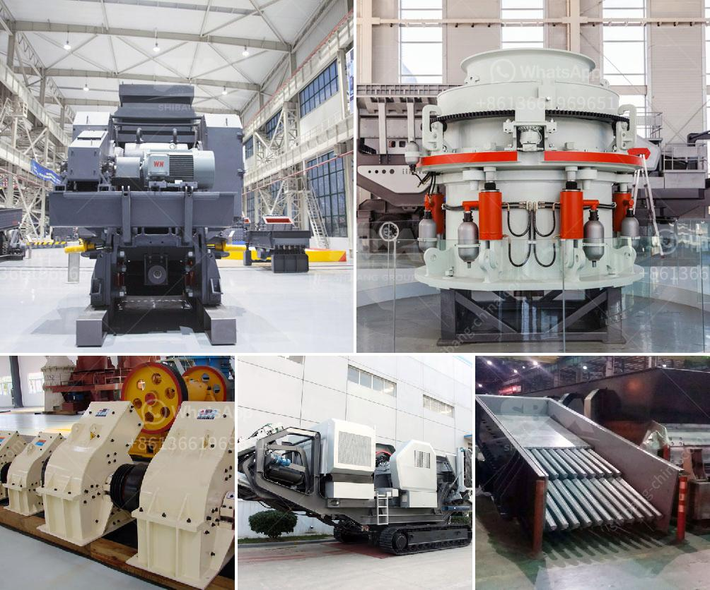

<h3>bentonite clay mining process</h3>
Bentonite clay, also known as Montmorillonite clay, is a naturally occurring sedimentary clay mineral formed from the weathering of volcanic ash deposits. It is one of the most abundant and versatile clays on Earth, found in various parts of the world. Bentonite clay has numerous applications in various industries, including construction, agriculture, and cosmetics. However, before it can be used, it must undergo a mining process.

The process of extracting bentonite clay begins with the exploration of deposits. The exploration process involves gathering information about the location, quality, and quantity of the deposits. The geologists and mining engineers use various techniques, such as satellite imaging, aerial surveys, and geophysical surveys, to locate the clay deposits. Once the potential deposits are identified, the next step is to obtain permission for exploration and mining from the relevant authorities.

The mining process involves several important steps. Firstly, the topsoil covering the clay deposit needs to be removed to expose the clay. This topsoil is carefully stored and can later be used for reclamation purposes. Once the clay is exposed, the next step involves removing any overburden or unwanted materials that may be present. This is usually done using heavy machinery, such as bulldozers and excavators.

After the overburden removal, the mining operation begins. Bentonite clay is a soft and easily excavated material, making it relatively simple to mine. Large-scale open-pit mining methods are commonly employed for bentonite clay extraction. This involves the use of heavy equipment to remove and transport the clay to the processing area.

Once the clay is transported to the processing area, it undergoes various refining processes to remove impurities and improve its quality. The clay is crushed, dried, and then milled into a fine powder. Crushing and drying help to reduce the moisture content and break down large clumps, making the clay easier to handle. Milling further refines the clay, ensuring a consistent particle size distribution.

After milling, the refined clay is often subjected to additional processes, such as air classification, to further purify and separate it according to specific requirements. These additional processes help to enhance the clay's properties, such as its absorption capacity, viscosity, and color.

Once the desired properties are achieved, the final product is often stored in bulk or packaged for distribution. Bentonite clay is commonly used in a variety of applications, such as drilling muds, cat litter, foundry castings, and even as a face mask in skincare products. The versatile nature of bentonite clay makes it a valuable resource for many industries.

In conclusion, the mining process of bentonite clay involves the exploration and identification of potential deposits, the removal of overburden and topsoil, and the extraction and refining of the clay. This process ensures that the clay's properties are properly enhanced and tailored to meet various industry requirements. Bentonite clay mining plays a vital role in supplying the industries with this versatile and valuable resource.
<h3>Contact us</h3><ul><li><strong>Whatsapp:&nbsp;<a href="https://wa.me/8613661969651">+8613661969651</a></strong></li><li><a href="https://swt.shibang-china.com/?git&amp;zhl&amp;bentonite clay mining process"><strong>Online Service(chat now)</strong></a></li></ul><h3>Related</h3><ul><li><a href='gold mining equipment for sale in south africa.md'>gold mining equipment for sale in south africa</a></li><li><a href='mobile crusher malaysia for sell.md'>mobile crusher malaysia for sell</a></li><li><a href='pulverized coal mill.md'>pulverized coal mill</a></li><li><a href='cone crushers for sale in philippines.md'>cone crushers for sale in philippines</a></li><li><a href='crusher machine discount.md'>crusher machine discount</a></li></ul>