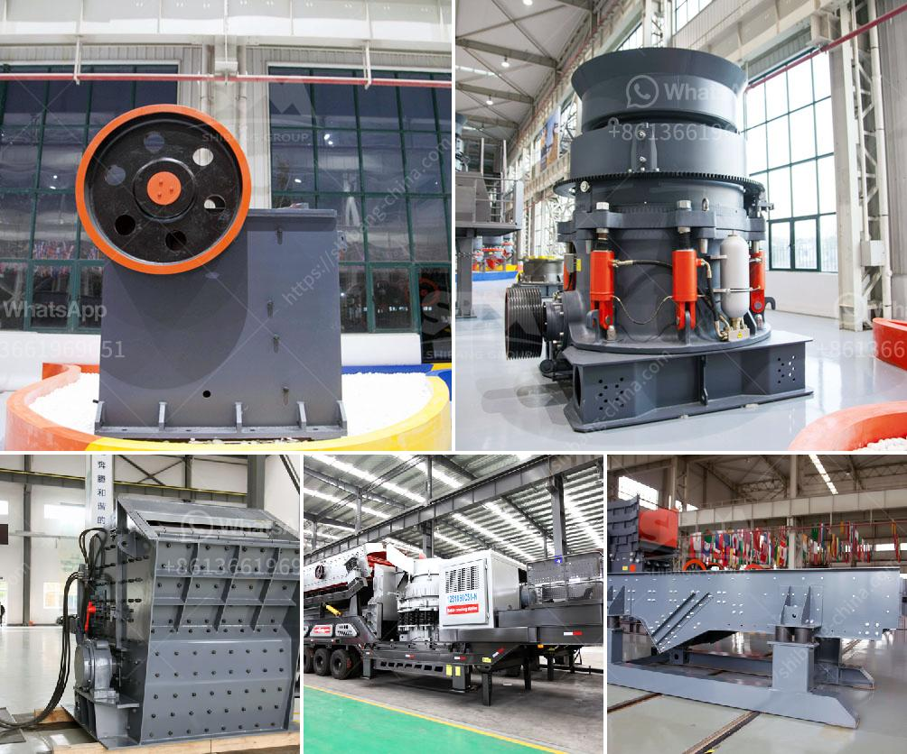

<h3>bentonite crushing manufacturing process</h3>
Bentonite is a natural clay mineral that has multiple applications in various industries, including manufacturing, drilling, construction, and agriculture. Bentonite is formed from volcanic ash and has a high absorbency property, making it ideal for absorbing and holding water. One of the key processes involved in bentonite manufacturing is the crushing process.

Bentonite ore is first mined and then crushed using different machinery to obtain the desired size. During the crushing process, jaw crushers, cone crushers, and impact crushers are commonly used. Jaw crushers break the raw materials into smaller particles by compressing it between two plates, whereas cone crushers and impact crushers utilize the principles of compression and impact to break the material.

After the initial crushing process, the crushed bentonite is then screened to separate the fine particles from the coarse ones. This ensures that the final product meets the desired size specifications. The fine particles are usually used in drilling muds or as mineral additives in various industries, while the coarse particles may be further processed or used as fillers in products like concrete.

Once the crushing and screening process is completed, the bentonite undergoes additional processes, such as drying and milling, to achieve the desired moisture content and particle size distribution. Drying involves removing any excess moisture from the crushed material using dryers, while milling involves grinding the dried bentonite to a fine powder.

In conclusion, the crushing process in bentonite manufacturing is a crucial step that determines the size and quality of the final product. Proper crushing ensures that the bentonite can be used effectively in various applications, such as drilling fluids, foundry sands, and cat litter. By understanding the bentonite crushing process, manufacturers can optimize their production and create high-quality products.
<h3>Contact us</h3><ul><li><strong>Whatsapp:&nbsp;<a href="https://wa.me/8613661969651">+8613661969651</a></strong></li><li><a href="https://swt.shibang-china.com/?git&amp;zhl&amp;bentonite crushing manufacturing process"><strong>Online Service(chat now)</strong></a></li></ul><h3>Related</h3><ul><li><a href='clay mill machine crusher price.md'>clay mill machine crusher price</a></li><li><a href='tonnes aggregate crusher in south africa crusher.md'>tonnes aggregate crusher in south africa crusher</a></li><li><a href='calcium powder plant.md'>calcium powder plant</a></li><li><a href='ball mills 7 x 12 usa.md'>ball mills 7 x 12 usa</a></li><li><a href='jaw crusher price capacity.md'>jaw crusher price capacity</a></li></ul>