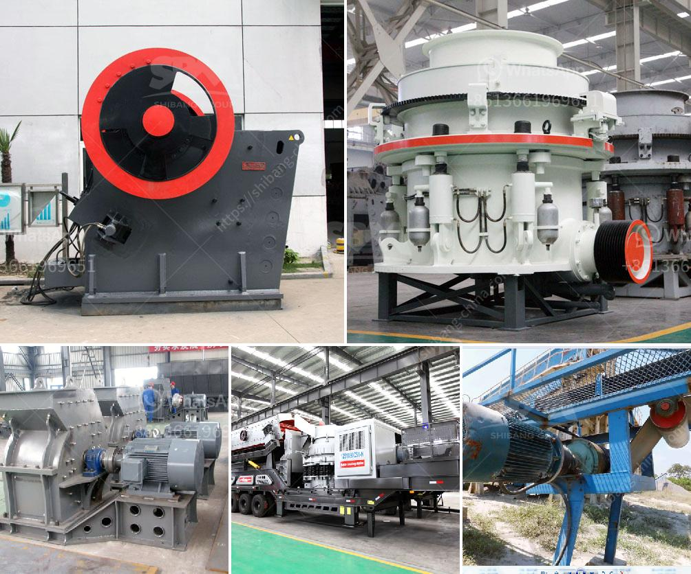

<h3>bentonite jaw crushers india</h3>
Bentonite Jaw Crushers India: The Bentonite Jaw Crusher is universally applicable in both primary and secondary crushing stages. In India, they are widely used in the mining industry, metallurgical industry, construction materials, highway, railway, water conservancy, chemical industry, and many other industries. However, it is primarily used in the mining industry for reducing the size of large rocks, ores, and other materials.

Bentonite is a clay mineral that is abundant in nature and has various industrial applications. It is formed from the weathering of volcanic ash, and its main component is montmorillonite, which gives it its unique properties. Bentonite has excellent absorbent and adsorbent properties, making it useful in a wide range of industries. It is used in drilling muds, foundry sands, cat litter, cosmetics, and pharmaceuticals, among many others.

The Bentonite Jaw Crusher is a highly efficient machine, designed to crush and reduce the size of bentonite into smaller particles. The jaw crusher is widely used in mining, building materials, chemical industry, metallurgy and so on. It is suitable for primary and secondary crushing of all kinds of minerals and rocks with compressive strength less than 320 MPa.

One of the outstanding features of the Bentonite Jaw Crusher is its high capacity. The machine has a crushing chamber, which is composed of a fixed jaw plate and a movable jaw plate. When the movable jaw plate moves towards the fixed jaw plate, the material is crushed and discharged through the discharge opening. The large crushing ratio ensures that the machine can process large quantities of material in a short period of time.

Another important feature of the Bentonite Jaw Crusher is its simple structure and easy maintenance. The machine is made up of a frame, an eccentric shaft, a big belt wheel, a flywheel, a side guard plate, an elbow plate, a rear bracket, and other parts. The machine can be easily assembled or disassembled for maintenance or cleaning. The simple design makes it easy to operate and maintain, reducing downtime and increasing productivity.

In addition, the Bentonite Jaw Crusher is energy-efficient. The machine consumes less energy compared to other crushers of the same capacity. This not only reduces operating costs but also helps to protect the environment. The energy-efficient design is achieved through the use of advanced technology and high-quality materials.

In conclusion, the Bentonite Jaw Crusher is an excellent choice for crushing bentonite materials. Its high capacity, simple structure, easy maintenance, and energy efficiency make it ideal for use in the mining industry. The machine is widely used in India and has gained a high reputation among its users. With its outstanding features and benefits, it is expected to continue to play a significant role in the industry for many years to come.
<h3>Contact us</h3><ul><li><strong>Whatsapp:&nbsp;<a href="https://wa.me/8613661969651">+8613661969651</a></strong></li><li><a href="https://swt.shibang-china.com/?git&amp;zhl&amp;bentonite jaw crushers india"><strong>Online Service(chat now)</strong></a></li></ul><h3>Related</h3><ul><li><a href='small diesel engine crusher from tanzania.md'>small diesel engine crusher from tanzania</a></li><li><a href='mini concrete crusher hire high wycombe.md'>mini concrete crusher hire high wycombe</a></li><li><a href='metal detector for iron ore crushing plant.md'>metal detector for iron ore crushing plant</a></li><li><a href='mobile stone crusher 100 tph bangalore.md'>mobile stone crusher 100 tph bangalore</a></li><li><a href='aggregate production.md'>aggregate production</a></li></ul>