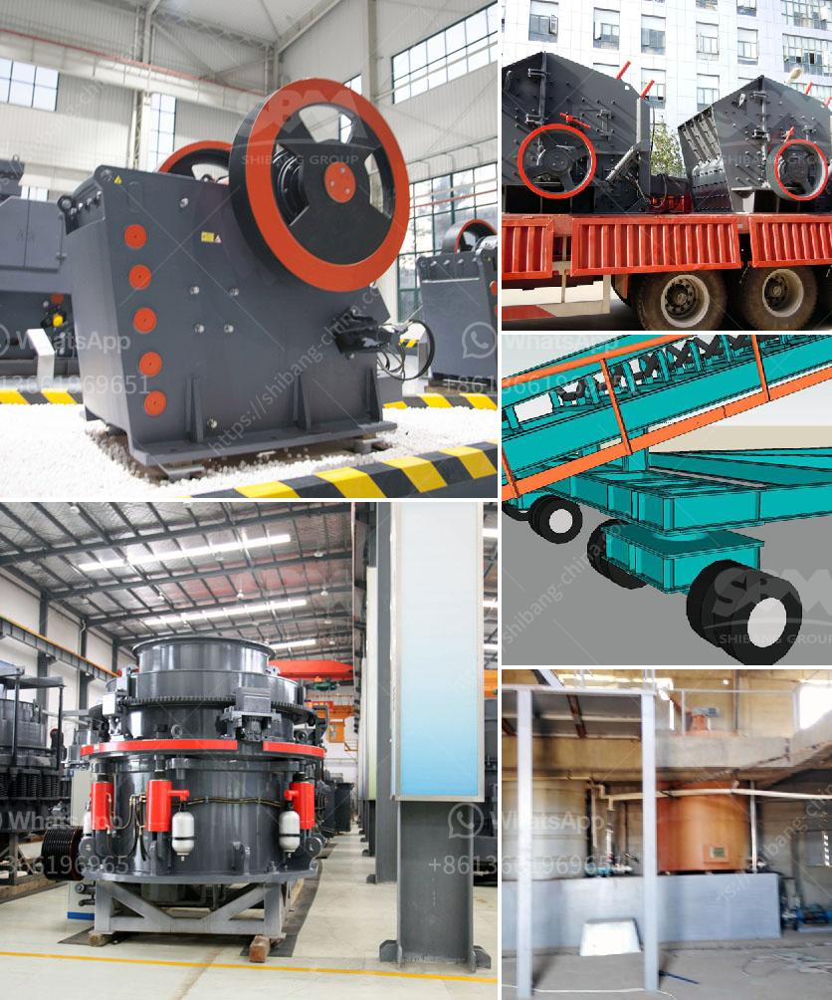

<h3>bentonite processing machinery</h3>
Bentonite is a versatile clay mineral commonly used in various industrial applications, such as foundry casting, drilling mud, and paper coating. It is a valuable resource that requires careful extraction and processing to ensure high-quality end products. Bentonite processing machinery plays a crucial role in optimizing the industrial process and enhancing efficiency.

Bentonite is primarily composed of the mineral montmorillonite, which forms in the weathering process of volcanic ash. It has unique properties, including high absorption capacity and thixotropic behavior. These characteristics make it widely used in multiple industries, driving the demand for advanced processing machinery.

One of the key steps in the processing of bentonite is drying. Bentonite ore is typically high in moisture content, which can negatively impact its performance and quality. Therefore, efficient drying techniques are essential to remove excess moisture and enhance its properties. Specialized machinery, such as flash dryers or rotary dryers, are commonly used in the industry to achieve optimal drying results.

After drying, the next step in the processing involves grinding the bentonite into a fine powder. This is crucial to increase its surface area and improve its effectiveness in various applications. The grinding process requires precise machinery that can finely crush the bentonite particles without altering its chemical composition. Roller mills or ball mills are commonly used for this purpose, ensuring efficient and consistent grinding.

In addition to drying and grinding, another critical aspect of bentonite processing is activation. Activation refers to the process of treating bentonite with additives, such as sodium carbonate or calcium oxide, to enhance its properties. These additives help to improve the absorbent capacity and increase its bonding strength. The activation process requires specialized machinery, such as paddle mixers or agglomerators, to ensure a thorough and uniform mixture.

Bentonite processing machinery also includes separation equipment, such as decanter centrifuges or hydrocyclones, to remove impurities and achieve the desired product purity. Separation is crucial to eliminate unwanted particles and ensure a consistent quality of bentonite for its intended applications.

Moreover, the automation and control systems incorporated in bentonite processing machinery have significantly improved efficiency and productivity. These systems allow for real-time monitoring and adjustment of processing parameters, optimizing the overall operation. From temperature control to moisture level monitoring, these technologies ensure consistent and reliable output.

As the demand for bentonite continues to grow, the advancement in processing machinery will further enhance its potential applications. Efficient processing machinery not only improves productivity but also reduces energy consumption and minimizes waste generation, making it a sustainable choice for the industry.

In conclusion, bentonite processing machinery is essential for ensuring the efficient and optimized production of high-quality bentonite products. From drying and grinding to activation and separation, specialized machinery plays a critical role in each stage of the process. The continuous development of advanced processing machinery will further expand the possibilities for bentonite applications in various industries, making it a valuable resource for years to come.
<h3>Contact us</h3><ul><li><strong>Whatsapp:&nbsp;<a href="https://wa.me/8613661969651">+8613661969651</a></strong></li><li><a href="https://swt.shibang-china.com/?git&amp;zhl&amp;bentonite processing machinery"><strong>Online Service(chat now)</strong></a></li></ul><h3>Related</h3><ul><li><a href='tons per day ball mill.md'>tons per day ball mill</a></li><li><a href='iron ore magnetic separation from titanium process.md'>iron ore magnetic separation from titanium process</a></li><li><a href='sand and gravel quarrying company in bicol.md'>sand and gravel quarrying company in bicol</a></li><li><a href='dolomite crushing production line equipment.md'>dolomite crushing production line equipment</a></li><li><a href='gypsum powder production plant ppt.md'>gypsum powder production plant ppt</a></li></ul>