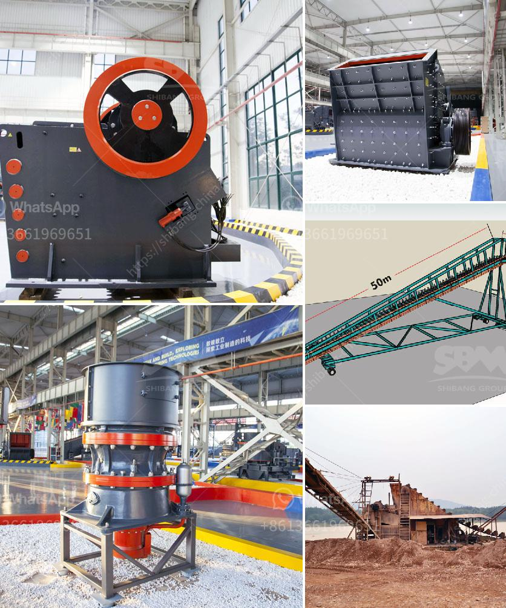

<h3>bentonite processing plant quotation</h3>
Bentonite is a mineral-rich clay that has been used for thousands of years for various applications, including in the medical, construction, and industrial sectors. It is known for its unique properties, such as its ability to absorb and retain water, as well as its high plasticity and swelling capacity. Due to its versatility and wide range of applications, the demand for bentonite has been steadily increasing, leading to the establishment of bentonite processing plants.

A bentonite processing plant is a facility where the mineral is extracted, processed, and refined to meet different specifications for various applications. The process typically involves a series of steps, including mining, crushing, drying, milling, and packaging. Each of these stages requires specific equipment and machinery to ensure that the bentonite is processed efficiently and meets the desired quality standards.

When setting up a bentonite processing plant, one of the critical aspects that plant owners and operators need to consider is obtaining the right quotation for the required equipment. The quotation will determine the overall cost of setting up the plant and ensure that all necessary machinery and equipment are included.

To get an accurate and comprehensive quotation for a bentonite processing plant, it is essential to take into account several factors. First and foremost, the plant's production capacity needs to be determined. This will help determine the scale and size of the equipment required, which will subsequently affect the overall cost.

Another crucial factor to consider is the specific requirements for the end product. Bentonite can be processed into various forms, including granules, powders, and pellets, depending on its intended application. Different processing methods and equipment may be required for each product type, so it is vital to provide clear specifications to the equipment supplier to obtain an accurate quotation.

Furthermore, the quality of the bentonite also plays a significant role in the processing plant quotation. Different grades of bentonite have different purity levels, moisture content, and particle size distribution, among other properties. These specifications will affect the choice of equipment and processing methods required to achieve the desired quality. Therefore, it is crucial to provide detailed information about the characteristics and quality requirements of the bentonite to ensure an accurate quotation.

In conclusion, establishing a bentonite processing plant requires careful consideration of several factors, including production capacity, end product requirements, and bentonite quality. Obtaining an accurate and comprehensive quotation for the necessary equipment is essential to ensure the successful setup of the plant. By providing detailed specifications and requirements to the equipment supplier, plant owners and operators can ensure that they receive an accurate quotation that aligns with their needs and budget.
<h3>Contact us</h3><ul><li><strong>Whatsapp:&nbsp;<a href="https://wa.me/8613661969651">+8613661969651</a></strong></li><li><a href="https://swt.shibang-china.com/?git&amp;zhl&amp;bentonite processing plant quotation"><strong>Online Service(chat now)</strong></a></li></ul><h3>Related</h3><ul><li><a href='gypsum crusher price in ethiopia.md'>gypsum crusher price in ethiopia</a></li><li><a href='prices of conveyor belt.md'>prices of conveyor belt</a></li><li><a href='hammer mill for coal in india.md'>hammer mill for coal in india</a></li><li><a href='mobile stone crusher in south africa.md'>mobile stone crusher in south africa</a></li><li><a href='to buy mobile crushing plant price.md'>to buy mobile crushing plant price</a></li></ul>