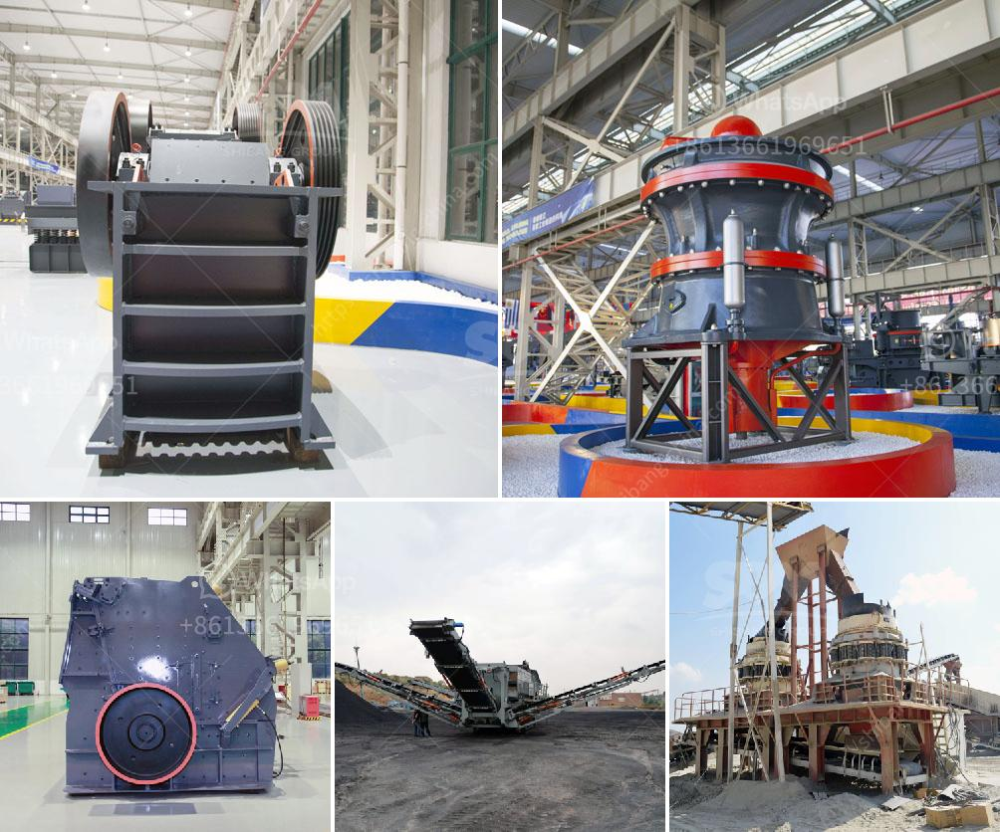

<h3>bentonite pulverizer ball mill in philippines</h3>
Bentonite is a natural mineral that mainly consists of the clay mineral montmorillonite. It is widely used in various industries such as foundry, drilling, construction, agriculture, and pharmaceuticals. One of the most common applications of bentonite is in the manufacturing of drilling muds for oil and gas wells.

To process and utilize bentonite, a bentonite pulverizer ball mill is indispensable. The ball mill is an efficient tool for grinding various ores and rocks. It is suitable for grinding bentonite and other materials, regardless of wet grinding or dry grinding. The ball mill is suitable for both batch and continuous operation, and it is widely used in the processing of cement, silicate products, new building materials, refractory materials, fertilizers, black and non-ferrous metal dressings, and glass ceramics, among others.

In the Philippines, the demand for bentonite pulverizer ball mills is continuously increasing due to its wide range of applications and the numerous advantages it offers. Firstly, the ball mill produces a uniform grind compared to other grinding techniques. This ensures that the ground bentonite particles have a consistent size, which is crucial in many industrial applications.

Secondly, the ball mill has a high grinding efficiency, which means that the energy consumption during the grinding process is relatively low. This not only saves energy costs but also reduces the carbon footprint, making it an environmentally friendly option.

Furthermore, the ball mill is easy to operate and maintain. It has a simple structure and requires minimal supervision, allowing for efficient operation and less downtime.

In conclusion, the bentonite pulverizer ball mill is an essential piece of equipment in the processing of bentonite. Its efficient grinding capabilities and low energy consumption make it a popular choice in various industries, including the Philippines. As the demand continues to grow, manufacturers are constantly improving the design and functionality of the ball mills to meet the needs of different applications.
<h3>Contact us</h3><ul><li><strong>Whatsapp:&nbsp;<a href="https://wa.me/8613661969651">+8613661969651</a></strong></li><li><a href="https://swt.shibang-china.com/?git&amp;zhl&amp;bentonite pulverizer ball mill in philippines"><strong>Online Service(chat now)</strong></a></li></ul><h3>Related</h3><ul><li><a href='impact crusher pdf.md'>impact crusher pdf</a></li><li><a href='small hammer mill grinder 10 mm.md'>small hammer mill grinder 10 mm</a></li><li><a href='dolamite powder machine.md'>dolamite powder machine</a></li><li><a href='grinding marble stone price.md'>grinding marble stone price</a></li><li><a href='stone crushing machine factories in shanghai.md'>stone crushing machine factories in shanghai</a></li></ul>