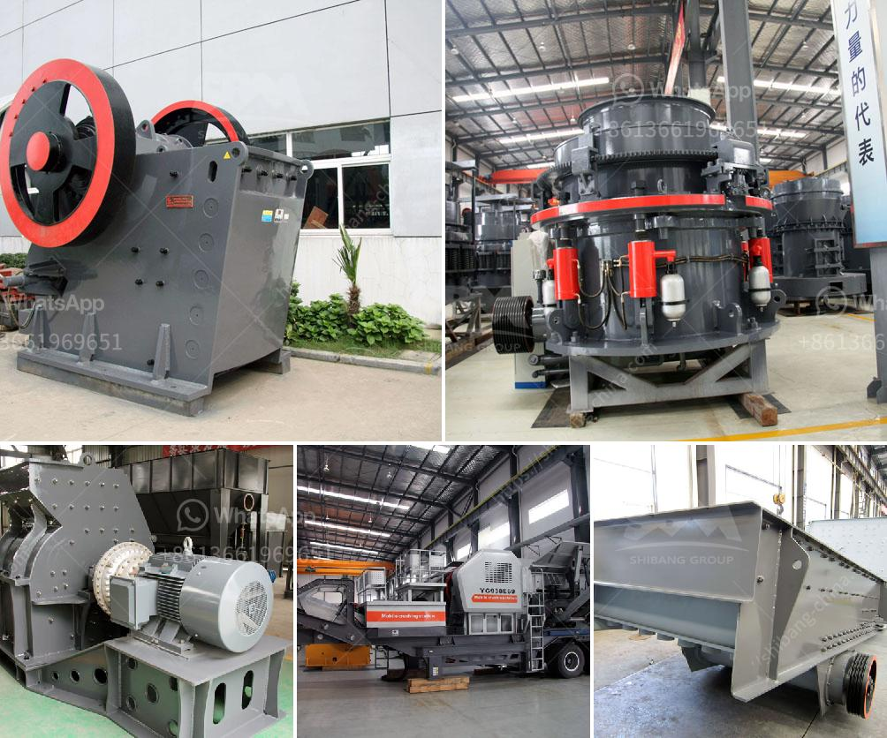

<h3>block making machine in canada</h3>
Canada, known for its technological advancements and modern infrastructure, has witnessed a significant rise in the construction industry over the years. This surge in demand for housing and commercial buildings has led to the need for efficient and innovative construction methods. One such groundbreaking technology that has revolutionized the construction processes is the block making machine.

Block making machines, also known as concrete block machines, have become a game-changer in the construction industry across Canada. These machines are designed to produce high-quality concrete blocks efficiently and at a faster pace, replacing the traditional manual block-making methods. They are widely used in the production of bricks, hollow blocks, and paving blocks, among other construction materials.

What sets the block making machine apart is its ability to produce uniform, sturdy, and precise concrete blocks. They come equipped with advanced features like automatic material feeding, mixing, and pressing, ensuring consistent results. The machine's automated operations enable construction companies to save time, reduce labor costs, and increase productivity.

Moreover, block making machines offer flexibility in producing blocks of various sizes and shapes, as per the construction requirements. This versatility allows architects and builders to unleash their creativity and explore innovative designs, thereby enhancing the aesthetic appeal of structures.

Furthermore, these machines contribute significantly to sustainable construction practices. They utilize eco-friendly materials, such as fly ash and recycled aggregates, reducing the ecological impact of construction processes. By producing blocks with higher compressive strengths, they also ensure longer-lasting structures, minimizing the need for frequent maintenance and repair.

The block making machine market in Canada has witnessed substantial growth, with several local as well as global manufacturers offering a wide range of machines. These manufacturers prioritize quality, durability, and customer satisfaction, ensuring that the machines meet the highest industry standards.

In conclusion, block making machines have transformed the construction industry in Canada, offering a more efficient, cost-effective, and sustainable solution for producing high-quality concrete blocks. Their ability to streamline operations, reduce labor costs, and enable innovative designs have made them an indispensable part of modern-day construction processes. With their increasing popularity and advancements in technology, the future of block making machines in Canada looks promising, heralding a new era in construction practices.
<h3>Contact us</h3><ul><li><strong>Whatsapp:&nbsp;<a href="https://wa.me/8613661969651">+8613661969651</a></strong></li><li><a href="https://swt.shibang-china.com/?git&amp;zhl&amp;block making machine in canada"><strong>Online Service(chat now)</strong></a></li></ul><h3>Related</h3><ul><li><a href='difference between a hammer crusher and a hammer mill.md'>difference between a hammer crusher and a hammer mill</a></li><li><a href='mining equipment for sale zimbabwe.md'>mining equipment for sale zimbabwe</a></li><li><a href='caterpillar stone crusher.md'>caterpillar stone crusher</a></li><li><a href='stone crusher hospital dhaka.md'>stone crusher hospital dhaka</a></li><li><a href='copper oxide processing plant.md'>copper oxide processing plant</a></li></ul>