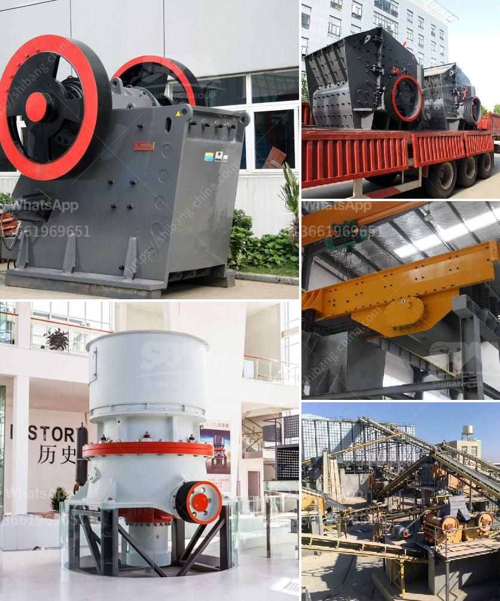

<h3>business plan for a calcium carbonate</h3>
Calcium carbonate, a versatile mineral compound, is vital to a wide range of industries across the globe, including agriculture, construction, pharmaceuticals, and food. Calcium carbonate offers an abundance of benefits, such as increased crop yields, healthier animal feed, improved manufacturing processes, and a reduction in environmental pollution.

To embark on a successful journey in the calcium carbonate industry, it is imperative to develop a comprehensive business plan. This plan should outline the key aspects of your venture, such as market analysis, target audience, production process, marketing strategy, and financial projections. Let’s delve into these aspects in detail.

Conduct extensive market research to identify the demand and potential customers for calcium carbonate in your chosen region. Determine the major industries that rely on calcium carbonate, such as agriculture, construction, paper, plastics, and paint. Assess the competition within the market and analyze their pricing, product quality, and marketing strategies. This research will enable you to identify any gaps in the market and develop a unique selling point for your business.

Define your target audience based on the industry sectors that heavily rely on calcium carbonate. Tailor your marketing strategy, product specifications, and pricing strategies to cater to the needs of these specific customers. Building a strong relationship with your target audience is crucial for long-term success and customer loyalty.

Outline the production process of calcium carbonate in your business plan. Determine the source of raw materials, such as limestone, marble, or chalk, and the mining or quarrying process involved. Describe the equipment and machinery required for the production process and discuss any potential challenges or regulatory requirements that need to be addressed.

Develop a comprehensive marketing and distribution strategy to ensure a consistent supply of calcium carbonate to your customers. Identify suitable distribution channels, such as direct sales, wholesalers, or online platforms, and establish partnerships with key stakeholders. Implement effective branding and promotional techniques to create awareness and attract customers. Develop a digital marketing strategy to leverage the power of social media platforms, search engine optimization, and targeted advertisements.

An integral part of any business plan is the financial projections. Estimate the initial capital investment required for setting up the calcium carbonate production facility, including equipment, labor, and operational costs. Calculate the projected revenue and expenses over a specific time period, considering factors like production capacity, market demand, pricing, and operational efficiency. Determine the break-even point and the return on investment to assess the financial viability of your business.

Incorporate sustainable and environmentally friendly practices into your business plan. Ensure that your production process adheres to all regulatory requirements governing waste management, emissions, and water usage. Consider implementing energy-saving measures, recycling programs, and utilizing renewable energy sources whenever possible to reduce the carbon footprint of your operations.

In conclusion, a well-designed business plan is essential for success in the calcium carbonate industry. By analyzing the market, understanding the target audience, outlining the production process, developing a strong marketing strategy, and considering financial projections, your business will be well-positioned to thrive and contribute to various industries that rely on calcium carbonate.
<h3>Contact us</h3><ul><li><strong>Whatsapp:&nbsp;<a href="https://wa.me/8613661969651">+8613661969651</a></strong></li><li><a href="https://swt.shibang-china.com/?git&amp;zhl&amp;business plan for a calcium carbonate"><strong>Online Service(chat now)</strong></a></li></ul><h3>Related</h3><ul><li><a href='quartz grinding machine cost.md'>quartz grinding machine cost</a></li><li><a href='italia dry mortar production line supplier.md'>italia dry mortar production line supplier</a></li><li><a href='stone crusher machine manufacturer in gujarat.md'>stone crusher machine manufacturer in gujarat</a></li><li><a href='crushing construction waste crusher.md'>crushing construction waste crusher</a></li><li><a href='equipment required for producing lime for new plant.md'>equipment required for producing lime for new plant</a></li></ul>