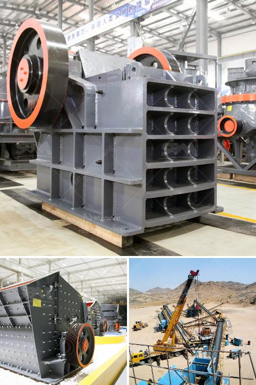

<h3>business plan for stone quarry crusher pdf</h3>
A business plan for stone quarry crusher should not just focus on the immediate surroundings of the mine, but rather the way in which it will approach a specific market. The stone quarry crusher plant selection is an important part in stone quarry business plan. To choose crushing machine, several factors need to be considered, such as ore property, final product requirements, investment capacity etc. We can design the different crushing plant. Different stone crusher machine can be used for crushing materials into different size.

Usually the complete quarrying plant uses jaw crusher for primary crushing, impact crusher for secondary crushing, then cone crusher as fine crusher. Apart from third impact crusher or you may choose sand maker, crusher, and mobile crusher plant, if you have needs, please contact us! We're here to help!

As we know, in mineral ore processing plant, grinding is the necessary stage, and ore milling equipment is the core equipment in the grinding stage. Ore milling equipment directly decides the quality and fineness of the final products and furthermore affects the beneficiation efficiency. So choosing suitable grinding mill means a lot in mineral ore processing line. Here we focus on hot sale grinding mills used for ore processing.

As a leading manufacturer, Zenith provides various ore milling equipments for the customers to process mineral ore, such as vertical grinding mill, ball mill, trapezium mill, ultrafine mill, hammer mill etc. Here we mainly talk about LM vertical grinding mill, MQ ball mill, MTW trapezium mill, which are the hot sale ones.

Floats under the buoyancy of upward pressure generated in the rotating process grinding roller, and that is when the grinding roller compacted crushed material in the disc edge increases. stuff and stuff in the grinding roller and millstone will not move directly from the feeding port into the roller and millstone, easy to start grinding hard, turning and laughing in pressure transmission, which does not produce.Dynamic and static milling disc and relative movement of a roller, causing the material layer in the shearing, crushing the material to be crushed by pressure.

Ball mill is a kind of mineral material grinding equipment, because its interior is equipped with steel ball so called ball mill. Ball mill is mainly work in the mineral processing production line grinding materials after crushing, preparing for the next stage of mineral processing. Overflow type ball mill is mainly composed of a cylinder body, an end cover, a main bearing, hollow axle neck, the transmission gear and the ore feeding end discharge. It's main use is for the processing of various minerals, such as gold ore, iron ore, copper ore, etc. It can reach different discharge particle sizes through different discharge methods.
<h3>Contact us</h3><ul><li><strong>Whatsapp:&nbsp;<a href="https://wa.me/8613661969651">+8613661969651</a></strong></li><li><a href="https://swt.shibang-china.com/?git&amp;zhl&amp;business plan for stone quarry crusher pdf"><strong>Online Service(chat now)</strong></a></li></ul><h3>Related</h3><ul><li><a href='powder making machine south africa.md'>powder making machine south africa</a></li><li><a href='crushing machine manufacturer in pakistan.md'>crushing machine manufacturer in pakistan</a></li><li><a href='industrial application of pebble mill.md'>industrial application of pebble mill</a></li><li><a href='dolomite crushing production line equipment.md'>dolomite crushing production line equipment</a></li><li><a href='stone crusher hospital dhaka.md'>stone crusher hospital dhaka</a></li></ul>