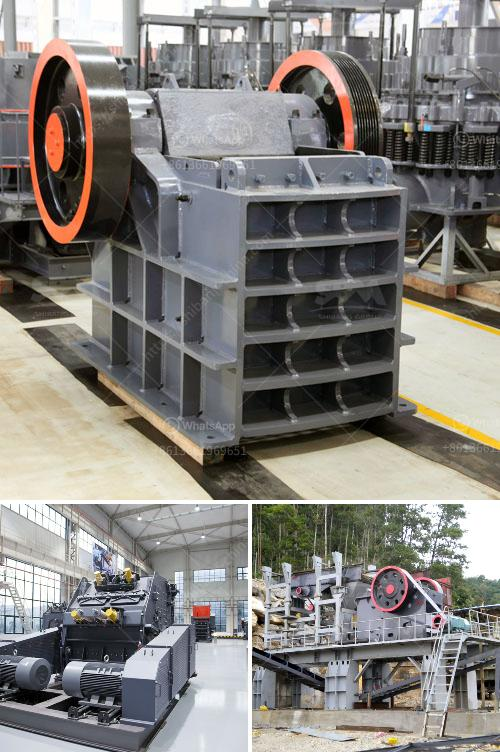

<h3>buy jaw crushers</h3>
Whether you’re in the mining, construction, or recycling industry, having a reliable piece of equipment that can crush materials efficiently is essential. Jaw crushers are widely used in various industries due to their ability to crush tough and abrasive materials with ease. If you’re looking to buy a jaw crusher, it’s important to consider several factors to ensure you make the right choice for your specific needs.

First and foremost, you should evaluate the capacity requirements of your operation. Jaw crushers come in different sizes and capacities to accommodate various production needs. For example, if you have a small-scale operation with low production demands, a smaller jaw crusher with a capacity of 50-100 tons per hour may suffice. However, for larger operations with high production requirements, you should opt for a jaw crusher with a capacity of 300-500 tons per hour.

Additionally, it’s crucial to assess the hardness and abrasiveness of the materials you’ll be crushing. Jaw crushers are designed to handle different types of materials, such as limestone, granite, basalt, and even recycled concrete. The hardness of the material will affect the wear and tear on the jaws, so it’s essential to choose a jaw crusher that is durable and can handle the toughness of the material.

Another important consideration when buying a jaw crusher is the feed size. The size of the material entering the crusher influences the size of the product output. Generally, jaw crushers can accept a maximum feed size of around 80% of the jaw opening width. However, the optimal feed size may vary depending on the type of material being crushed. For example, softer materials may require a larger feed size, while harder materials may require a smaller feed size.

The efficiency of a jaw crusher is also a key factor to consider. Look for a crusher that features a high reduction ratio, which is the ratio of the size of the input material to the size of the output product. This means that the crusher can efficiently reduce the size of the material, resulting in a higher production rate and increased efficiency.

Additionally, consider the maintenance and operational costs of the jaw crusher. Look for a machine that is easy to maintain and has readily available spare parts. Quality jaw crushers often feature a simple design with fewer moving parts, reducing the risk of mechanical breakdowns and minimizing the need for repairs.

Furthermore, it’s advisable to purchase your jaw crusher from a reputable manufacturer or supplier. Look for a company with a long-standing reputation for producing reliable, high-quality equipment. Reading customer reviews and seeking recommendations from industry professionals can help you make an informed decision.

To summarize, when buying a jaw crusher, assess your capacity requirements, consider the hardness and abrasiveness of the materials you’ll be crushing, evaluate the feed size range, prioritize efficiency, and factor in maintenance and operational costs. By taking these factors into account and selecting a reputable supplier, you can ensure you’re investing in a jaw crusher that will meet your needs and contribute to the success of your operation.
<h3>Contact us</h3><ul><li><strong>Whatsapp:&nbsp;<a href="https://wa.me/8613661969651">+8613661969651</a></strong></li><li><a href="https://swt.shibang-china.com/?git&amp;zhl&amp;buy jaw crushers"><strong>Online Service(chat now)</strong></a></li></ul><h3>Related</h3><ul><li><a href='jaw crusher price capacity.md'>jaw crusher price capacity</a></li><li><a href='hammer mill ghana.md'>hammer mill ghana</a></li><li><a href='denver ball mills.md'>denver ball mills</a></li><li><a href='stone crusher manufacturer dhaka.md'>stone crusher manufacturer dhaka</a></li><li><a href='small cement plant for sale.md'>small cement plant for sale</a></li></ul>