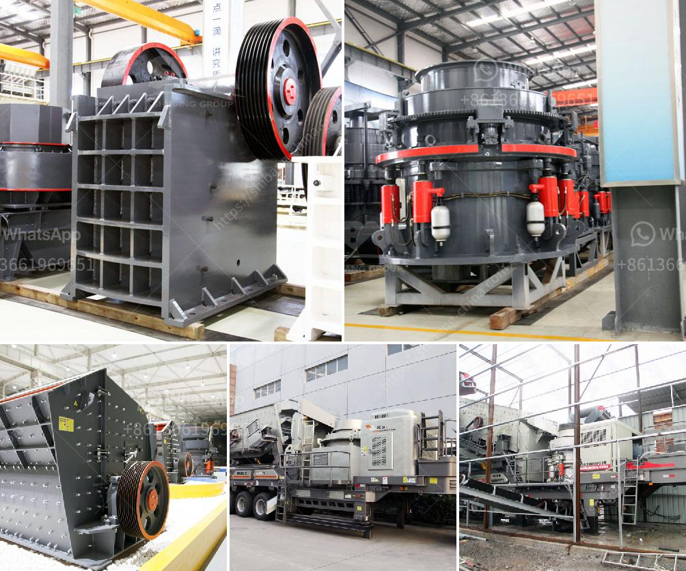

<h3>buy stone quarry crusher equipment from europe</h3>
When it comes to buying stone quarry crusher equipment from Europe, there are several factors to consider. Europe is known for its high-quality construction machinery, and stone quarry crushers are no exception. These crushers are designed to crush stones into smaller sizes, making them suitable for various construction projects.

One of the main advantages of buying stone quarry crusher equipment from Europe is the wide range of options available. There are numerous manufacturers and suppliers across the continent, each offering different types of crushers to meet various needs. Whether you are looking for a primary or secondary crusher, there is a European-made option that can cater to your specific requirements.

In addition to the variety of options, European stone quarry crusher equipment is known for its durability and longevity. These crushers are built to withstand heavy workloads and harsh conditions, making them ideal for quarrying operations. The robust construction ensures that the machinery can handle large rocks and stones without causing any damage or breakdown.

Another advantage of buying stone quarry crusher equipment from Europe is the advanced technology employed in the manufacturing process. European manufacturers are known for their innovative designs and cutting-edge features. From automated systems to remote control operation, these crushers are equipped with the latest technology to enhance efficiency and productivity.

When purchasing stone quarry crusher equipment from Europe, it is important to research and compare different suppliers. This will help you find the best value for your money and ensure that you are investing in high-quality machinery. Consider factors such as the manufacturer's reputation, customer reviews, and after-sales service.

Overall, buying stone quarry crusher equipment from Europe is a smart investment for any construction company or contractor. The wide range of options, durability, advanced technology, and high-quality construction make European-made crushers a reliable and efficient choice. So, whether you are upgrading your existing machinery or starting a new project, consider purchasing stone quarry crusher equipment from Europe.
<h3>Contact us</h3><ul><li><strong>Whatsapp:&nbsp;<a href="https://wa.me/8613661969651">+8613661969651</a></strong></li><li><a href="https://swt.shibang-china.com/?git&amp;zhl&amp;buy stone quarry crusher equipment from europe"><strong>Online Service(chat now)</strong></a></li></ul><h3>Related</h3><ul><li><a href='rock crushing plant for sale.md'>rock crushing plant for sale</a></li><li><a href='gypsum mill production.md'>gypsum mill production</a></li><li><a href='used marble machinery turkey.md'>used marble machinery turkey</a></li><li><a href='mobile vibrating screen.md'>mobile vibrating screen</a></li><li><a href='quartz mining process.md'>quartz mining process</a></li></ul>