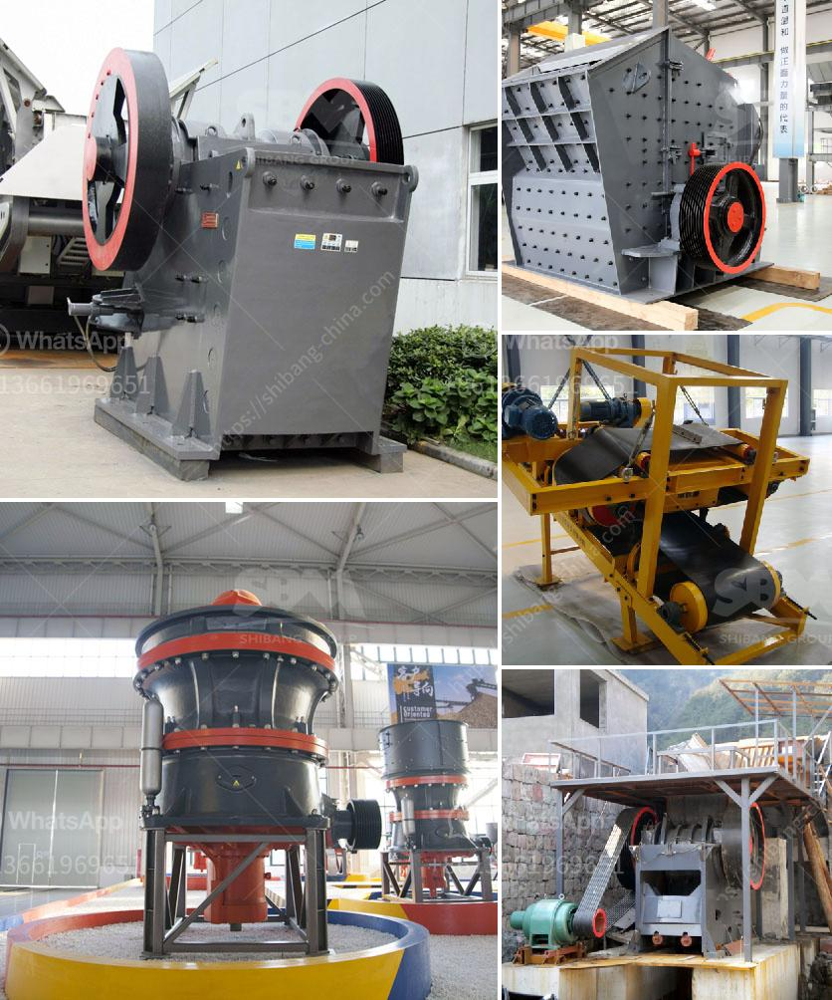

<h3>buyers ball mill process</h3>
The ball mill process is one of the most commonly used processes in today's industry. Numerous companies worldwide use ball mills for the manufacturing processes. This is mainly due to the fact that ball mills offer immense flexibility when it comes to the size and distribution of particles. In this article, we will discuss the ball mill process and its importance for buyers.

First and foremost, let us understand what a ball mill is. A ball mill is a type of grinding mill that works by mixing and grinding materials together. The purpose of this process is to homogenize the materials and break them down into smaller particles. Thanks to the innovative design of a ball mill, materials are processed in a highly controlled environment, preventing contamination and ensuring consistent results.

Buyers who invest in ball mills benefit from a wide range of applications. In industries like mining, cement production, and pharmaceuticals, ball mills are indispensable for grinding and pulverizing materials. They are also used in the chemical industry to mix chemicals together and create new compounds. Furthermore, ball mills are used in the production of building materials like cement, ceramics, and concrete.

When it comes to purchasing a ball mill, buyers should consider several factors. The first factor to consider is the size and capacity of the mill. Larger mills are capable of processing higher quantities of materials, but they also come with higher costs. Buyers should analyze their production needs and make an informed decision accordingly.

Another important factor is the material and lining quality of the ball mill. The lining of the mill should be made from durable materials that can withstand the grinding process without wearing out quickly. In this regard, buyers should research reliable manufacturers who use high-quality materials for their ball mills.

It is also essential to consider the energy efficiency of the ball mill. Energy-efficient mills can significantly reduce operational costs. Buyers should look for mills that are designed to minimize energy consumption while maintaining optimal performance. Some mills come equipped with advanced features, such as variable speed drives, which can further enhance energy efficiency.

Additionally, buyers should consider the simplicity of maintenance and operation. A well-designed ball mill should be easy to operate, with clear instructions and user-friendly controls. Maintenance should also be straightforward, with easy access to critical components for cleaning, lubrication, and repairs. Buyers should evaluate the support and after-sales services provided by the manufacturer to ensure a smooth operation.

In conclusion, the ball mill process plays a crucial role in many industries, offering a versatile and efficient solution for grinding, mixing, and homogenizing materials. Buyers should carefully consider factors such as size and capacity, material quality, energy efficiency, and ease of maintenance when purchasing a ball mill. By selecting a reliable manufacturer and investing in a high-quality mill, buyers can ensure long-term success and productivity in their manufacturing processes.
<h3>Contact us</h3><ul><li><strong>Whatsapp:&nbsp;<a href="https://wa.me/8613661969651">+8613661969651</a></strong></li><li><a href="https://swt.shibang-china.com/?git&amp;zhl&amp;buyers ball mill process"><strong>Online Service(chat now)</strong></a></li></ul><h3>Related</h3><ul><li><a href='sand dryer machines suppliers south africa.md'>sand dryer machines suppliers south africa</a></li><li><a href='law requirements in stone crushing industry.md'>law requirements in stone crushing industry</a></li><li><a href='rock crusher plans.md'>rock crusher plans</a></li><li><a href='list of the price of crushing plant turkey.md'>list of the price of crushing plant turkey</a></li><li><a href='mobile crushing plant manufacturers.md'>mobile crushing plant manufacturers</a></li></ul>