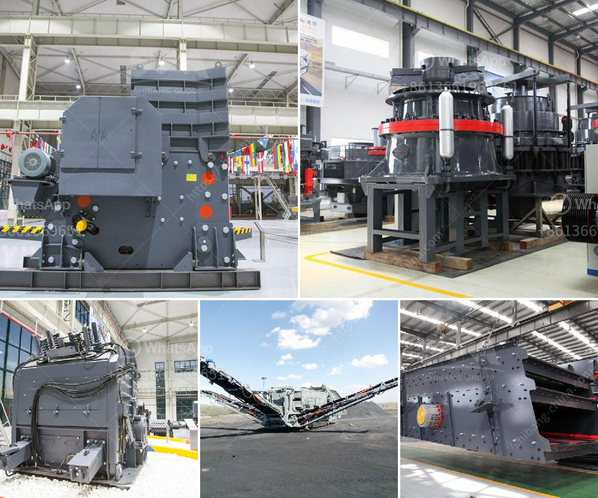

<h3>calcite crusher for sale</h3>
Calcite is a widely distributed mineral, mainly used in construction and cement production. It is one of the most important industrial raw materials, which is widely used in various industries. However, it can be easily ground into fine powder due to its low hardness. Therefore, the calcite crushing equipment plays a vital role in the process of calcite crushing.

Calcite crusher for sale is one of the most advanced and efficient mining equipment on the market today. It has a number of exceptional features that make it a great choice for crushing materials. These features include sophisticated design, sturdy construction, low maintenance requirements, and reliable performance.

The calcite crusher for sale has a unique crushing chamber design, which enhances the capacity and efficiency of the crushing process. The fixed cone assembly is specifically designed for secondary or tertiary crushing stages, thereby ensuring optimal particle size distribution and increasing the production capacity. The crushing chamber geometry allows for rapid and easy liner replacement, reducing downtime and improving operational efficiency.

In addition to its unique crushing chamber design, the calcite crusher for sale also has several other outstanding features. For example, the hydraulic system ensures easy operation and adjustment. The release system allows tramp materials to pass through the crushing chamber without causing damage to the crusher. The hydraulic motor provides a consistent crushing force and protects the crusher from overload.

Another important feature of the calcite crusher for sale is its robust construction. The main frame is made of high-quality steel, ensuring durability and long service life. The crusher is also equipped with high-strength bolts and enhanced components, making it capable of handling tough and abrasive materials. Additionally, the crusher is equipped with a dust-proof sealing system, which minimizes dust pollution and improves the working environment.

Maintenance is an important aspect to consider when purchasing any mining equipment, including the calcite crusher. The calcite crusher for sale requires minimal maintenance, thanks to its intelligent design and high-quality components. Routine maintenance tasks, such as lubrication and inspections, can be easily carried out without the need for specialized tools or extensive downtime.

The calcite crusher for sale is designed with a high-temperature resistant foundation, ensuring safety and stability during operation. Additionally, a PLC intelligent control system is installed to monitor the crusher's operation, preventing any potential damage caused by abnormal operation.

In conclusion, the calcite crusher for sale is an ideal choice in terms of efficiency, cost-effectiveness, and reliability. It is suitable for crushing various materials with compressive strength up to 320 MPa. The unique design and advanced technology ensure the calcite crusher's durability, even in the harshest conditions. With its exceptional performance, it is widely used in metallurgy, mining, cement, construction, chemical, and other industries. If you are searching for a high-quality calcite crusher, look no further and consider the calcite crusher for sale.
<h3>Contact us</h3><ul><li><strong>Whatsapp:&nbsp;<a href="https://wa.me/8613661969651">+8613661969651</a></strong></li><li><a href="https://swt.shibang-china.com/?git&amp;zhl&amp;calcite crusher for sale"><strong>Online Service(chat now)</strong></a></li></ul><h3>Related</h3><ul><li><a href='to buy mobile crushing plant price.md'>to buy mobile crushing plant price</a></li><li><a href='stone crushers industries in west bengal.md'>stone crushers industries in west bengal</a></li><li><a href='jaw crusher moby.md'>jaw crusher moby</a></li><li><a href='stone crushing process costs.md'>stone crushing process costs</a></li><li><a href='vertical grinder mill price.md'>vertical grinder mill price</a></li></ul>