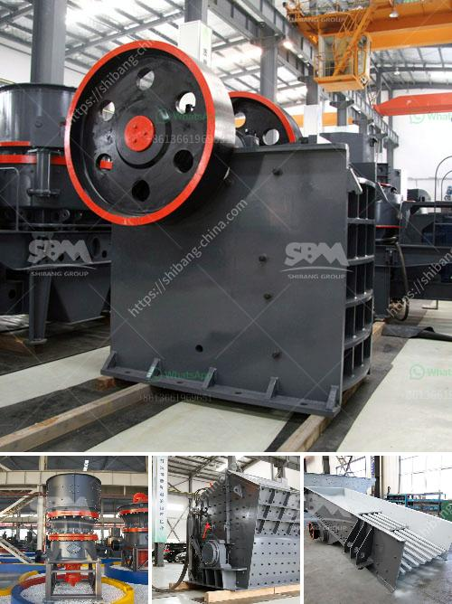

<h3>calcite crushing machine</h3>
Calcite is a calcium carbonate mineral that is commonly found in limestone deposits. It is usually mined as a white or gray-colored crystal or powder and used as a raw material in a variety of industries, such as the construction and manufacturing sectors.

To meet the growing demands of these industries, the need for efficient calcite crushing machines is paramount. In this article, we explore the various types of calcite crushing machines and their distinctive features that make them stand out in the market.

The jaw crusher is a reliable and robust machine that is engineered to deliver high-quality outputs. Designed for durability and efficiency, it excels in medium to hard rock crushing applications. The machine is equipped with a hydraulic toggle system that allows easy adjustment of the jaw crusher setting, simplifying the process of closing or opening the crushers' jaws to achieve the desired product size.

The cone crusher is another powerful machine used in the crushing of calcite. It comes with a rotating mantle inside a concave bowl, which is connected to the main shaft. The eccentric movement of the bowl ensures that the calcite is crushed to the desired size. Through its efficient crushing action, the cone crusher reduces raw calcite into more marketable sizes.

The impact crusher, on the other hand, is ideal for crushing soft or medium-hard calcite materials. It offers outstanding versatility, making it suitable for various crushing applications. One key feature of the impact crusher is its ability to provide precise control over the discharge size. This machine is often used in the production of aggregates, where the calcite needs to be broken down into specific sizes.

The hammer crusher is characterized by high crushing ratio, low energy consumption, and easy maintenance. It operates by striking calcite with a high-speed rotating hammer, which causes the material to break apart. The hammer crusher is suitable for both dry and wet crushing, making it an excellent choice for processing calcite with different moisture levels.

The VSI crusher, or vertical shaft impactor, is a highly versatile machine that is used for tertiary or quaternary crushing. It is designed to produce fine calcite particles with high quality and superior shape. The VSI crusher operates on the principle of centrifugal force by throwing the calcite against hard surfaces, such as anvils and screens. This action effectively breaks down the calcite into smaller particles.

In conclusion, the choice of a calcite crushing machine depends on the specific requirements and budget of the project. Each type of machine offers distinct advantages and features that cater to different crushing needs. Whether it's a jaw crusher for primary crushing or a VSI crusher for fine calcite particles, these machines are designed to provide efficient and reliable performance.

Investing in the right calcite crushing machine can significantly boost the productivity and profitability of your project. Take the time to evaluate your specific needs and consult with industry experts to make an informed decision. With the multitude of options available, you can find the perfect machine that suits your crushing requirements.
<h3>Contact us</h3><ul><li><strong>Whatsapp:&nbsp;<a href="https://wa.me/8613661969651">+8613661969651</a></strong></li><li><a href="https://swt.shibang-china.com/?git&amp;zhl&amp;calcite crushing machine"><strong>Online Service(chat now)</strong></a></li></ul><h3>Related</h3><ul><li><a href='stone crushers in botswana.md'>stone crushers in botswana</a></li><li><a href='quartz stone dust equipment.md'>quartz stone dust equipment</a></li><li><a href='high capacity r ore raymond mill with competitive price.md'>high capacity r ore raymond mill with competitive price</a></li><li><a href='static jaw crusher for sale in south africa.md'>static jaw crusher for sale in south africa</a></li><li><a href='stone crusher indonesia dan jerman.md'>stone crusher indonesia dan jerman</a></li></ul>