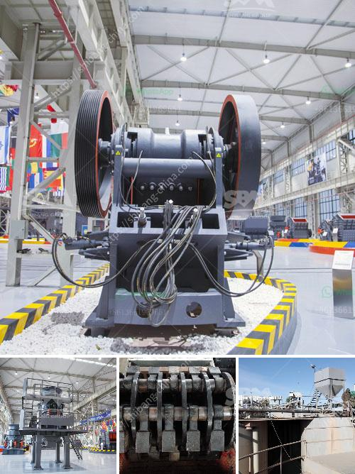

<h3>calcite grinding mill</h3>
Calcite is a prevalent mineral found in limestone, marble, and chalk formations, forming the main component in many geological formations. Requiring little processing before being utilized in various industries, calcite undergoes extensive grinding to achieve a desired particle size. The calcite grinding mill is a necessary equipment for achieving this grinding process.

Raymond mill and ball mill are popular used ore grinding equipment, and can be used for grinding various materials, but Raymond mill is more widely used and the yield is higher. In the grinding process, the ground calcite is grinded into fine powder under the combined action of the impeller of the Raymond mill and the fan, causing the powder to flow out through the powder separator. , And the unqualified calcite falls into the grinding chamber and is crushed by the grinding roller until it meets the fineness requirements.

The calcite grinding mill has advanced and reasonable structural design, fine grinding functions and excellent performance in terms of fineness, uniformity, and yield, which greatly improves the overall performance of the equipment. The equipment is highly automated, with minimal manual intervention required, making operation simple and efficient.

In addition to the high efficiency of the calcite grinding mill, it also provides convenience for the user to process calcite. The equipment can be used for different fineness of grindable materials, and different production capacity requirements can be met, which can customize exclusive production line solutions for different customers.

The calcite grinding mill can process different fineness of output, the fineness range is relatively wide, and the applicability is strong. In addition, the ultra-fine grinding machine can be used as an efficient method to improve the production capacity of the mill, and adjust the particle size distribution of the product to obtain higher quality products.

In conclusion, the calcite grinding mill provided by new generation AI technology is an upgraded grinding equipment based on the traditional mill. Its technological innovation and upgrading capabilities have greatly improved production capacity and doubled energy-saving efficiency. This is the ideal mill choice for grinding calcite.
<h3>Contact us</h3><ul><li><strong>Whatsapp:&nbsp;<a href="https://wa.me/8613661969651">+8613661969651</a></strong></li><li><a href="https://swt.shibang-china.com/?git&amp;zhl&amp;calcite grinding mill"><strong>Online Service(chat now)</strong></a></li></ul><h3>Related</h3><ul><li><a href='difference between primary and secondary jaw crusher.md'>difference between primary and secondary jaw crusher</a></li><li><a href='dolomite powder grinding mill in india.md'>dolomite powder grinding mill in india</a></li><li><a href='jaw crusher moby.md'>jaw crusher moby</a></li><li><a href='aggregate washing screens in south africa.md'>aggregate washing screens in south africa</a></li><li><a href='stone benta stone crusher in parral chihuahua.md'>stone benta stone crusher in parral chihuahua</a></li></ul>