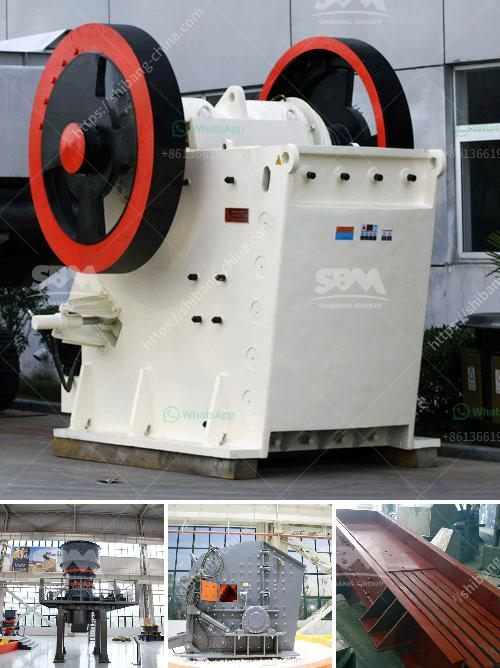

<h3>calcite powder machine</h3>
Calcite is a calcium carbonate mineral, often referred to as limestone, which is widely distributed in nature. It is mainly used in the fields of construction, metallurgy, chemical industry, cement, etc. Calcite powder machine is a commonly used mineral processing equipment in the field of grinding. Its purpose is to grind minerals, such as calcite or limestone, into fine powder.

Calcite powder machine is an important grinding equipment in the milling industry, and has been widely used in the metallurgical industry, mining industry, chemical industry, building materials, and other fields. Through the continuous improvement of technology and the accumulation of experience, the calcite powder machine has the characteristics of high efficiency, low energy consumption, small footprint, easy operation, etc. It has become an ideal equipment for the processing of calcite or limestone powder.

The calcite powder machine has an integrated crushing system, a lifting system, a grinding system, a grading system, and a collection system. The main component of the crushing system is a crusher, which is mainly used to crush large pieces of calcite or limestone into smaller particles. After crushing, the particles are transferred to the grinding system by the inclined belt conveyor. The grinding system consists of a main machine, an analysis machine, a fan, a dust collector, and a pipeline. The main machine is used to grind the material into powder, while the analysis machine is used to check the fineness of the powder. The fan provides the necessary wind power for the grinding system, and the dust collector is used to collect the dust generated during the grinding process. Finally, the finished powder is collected and packaged by the collection system.

The calcite powder machine has the advantages of high output, low energy consumption, high grinding efficiency, environmental protection, and cleanliness. It adopts advanced technology and unique structural design, which can effectively reduce the production and operation costs. In addition, the calcite powder machine has the characteristics of easy operation, stable performance, and long service life. It can be used for grinding various materials with Mohs hardness below 7 and humidity below 6%.

In conclusion, the calcite powder machine is a versatile mineral processing equipment that has been widely used in various industries. It provides an efficient and reliable solution for the grinding and processing of calcite or limestone powder. With its advanced technology and excellent performance, it has become an indispensable equipment in the milling industry. As the demand for powder materials continues to increase, the calcite powder machine will play an even more important role in the future.
<h3>Contact us</h3><ul><li><strong>Whatsapp:&nbsp;<a href="https://wa.me/8613661969651">+8613661969651</a></strong></li><li><a href="https://swt.shibang-china.com/?git&amp;zhl&amp;calcite powder machine"><strong>Online Service(chat now)</strong></a></li></ul><h3>Related</h3><ul><li><a href='used korean made stone crusher.md'>used korean made stone crusher</a></li><li><a href='salt crusher plant process price.md'>salt crusher plant process price</a></li><li><a href='rock crushing cone.md'>rock crushing cone</a></li><li><a href='limestone vertical mill.md'>limestone vertical mill</a></li><li><a href='crusher for pozzolana.md'>crusher for pozzolana</a></li></ul>