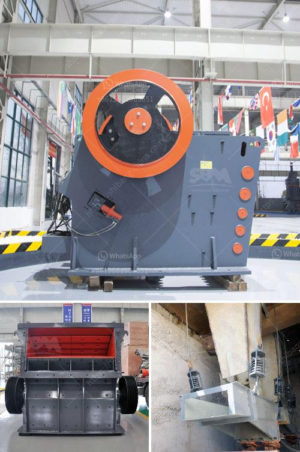

<h3>calcium carbonate crushing machinery</h3>
Calcium carbonate, or CaCO3, is one of the most common minerals found on the Earth. It is the main component of shells and bones and is formed naturally in the ocean through the precipitation of calcium ions with carbonate ions. Due to its abundance and versatile properties, calcium carbonate has become an essential ingredient in a wide range of industries.

To obtain calcium carbonate in its powdered form, various crushing machinery can be used, such as jaw crushers, hammer mills, and ball mills. The impact of these machines on calcium carbonate is significant, as they not only crush the calcium carbonate rocks but also disintegrate them, increasing the overall surface area of the particles.

Jaw crushers are commonly used machines in aggregate production, mining operations, and recycling applications. They are designed to crush large rocks or ores into smaller, more manageable sizes. In the case of calcium carbonate, these machines can efficiently reduce large chunks or lumps of calcium carbonate to smaller, more uniform particles.

Hammer mills are another commonly used machine for calcium carbonate crushing. They operate by repeatedly striking the material with rotating hammers, causing it to break into smaller pieces. Hammer mills are suitable for processing a wide range of materials, including calcium carbonate, and can achieve particle sizes in the range of microns.

Ball mills are often used in the final stages of the calcium carbonate production process. These mills can grind calcium carbonate particles to sub-micron sizes, generating a fine powder suitable for various industrial applications. The ball mill works by rotating a cylinder filled with steel balls, causing the balls to fall back into the cylinder and onto the material to be ground. The continuous motion of the balls effectively crushes calcium carbonate particles, resulting in a finely ground product.

In conclusion, calcium carbonate crushing machinery plays a crucial role in the processing of this versatile mineral. Whether it is for the production of smaller particle sizes or finely ground powders, various machines like jaw crushers, hammer mills, and ball mills can effectively crush calcium carbonate rocks and enhance their properties. The use of these machines ensures that calcium carbonate remains a vital component in many industries, contributing to economic growth and innovation.
<h3>Contact us</h3><ul><li><strong>Whatsapp:&nbsp;<a href="https://wa.me/8613661969651">+8613661969651</a></strong></li><li><a href="https://swt.shibang-china.com/?git&amp;zhl&amp;calcium carbonate crushing machinery"><strong>Online Service(chat now)</strong></a></li></ul><h3>Related</h3><ul><li><a href='calcium powder plant.md'>calcium powder plant</a></li><li><a href='ball mill with high quality and best price.md'>ball mill with high quality and best price</a></li><li><a href='equipment for gold mining belgium.md'>equipment for gold mining belgium</a></li><li><a href='ball milling in bangalore.md'>ball milling in bangalore</a></li><li><a href='silica powder grinding machine.md'>silica powder grinding machine</a></li></ul>