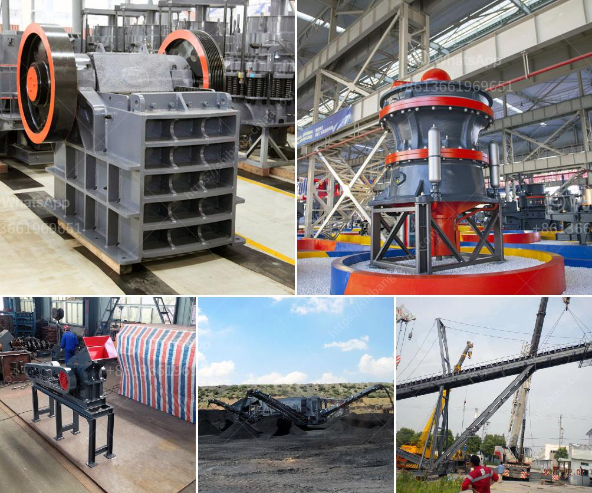

<h3>calcium carbonate grinding mill</h3>
Calcium carbonate is a compound that is widely used in various industries. It is an essential component in the construction, agriculture, plastics, and pharmaceutical industries. This compound is also commonly found in rocks such as limestone, marble, and chalk.

To produce calcium carbonate powder, calcium carbonate grinding mill is necessary. It is a high-efficiency and low-energy consuming equipment. The calcium carbonate grinding mill can grind various ores and other materials either wet or dry.

With the development of technology and market demand, the calcium carbonate grinding mill has evolved and upgraded, making it more versatile and easy to use. It can now grind the calcium carbonate into different particle sizes ranging from coarse to fine, depending on the application.

One of the significant advantages of the calcium carbonate grinding mill is its ability to produce a uniform and consistent particle size distribution. This is essential in industries such as agriculture, where the size of the calcium carbonate particles impacts its efficiency as a soil conditioner.

Furthermore, the grinding mill can also be customized to meet specific requirements. For instance, it can be equipped with an air classifier to separate the fine particles from the coarse ones, ensuring a more precise and efficient grinding process.

In addition to its versatility and customization options, the calcium carbonate grinding mill is also energy efficient. It uses less energy compared to other grinding machines, resulting in lower operational costs and reduced environmental impact.

In conclusion, the calcium carbonate grinding mill is a versatile and efficient equipment that is highly beneficial for various industries. Its ability to produce a uniform particle size distribution, customization options, and energy efficiency make it an ideal choice for grinding calcium carbonate.
<h3>Contact us</h3><ul><li><strong>Whatsapp:&nbsp;<a href="https://wa.me/8613661969651">+8613661969651</a></strong></li><li><a href="https://swt.shibang-china.com/?git&amp;zhl&amp;calcium carbonate grinding mill"><strong>Online Service(chat now)</strong></a></li></ul><h3>Related</h3><ul><li><a href='ball mill price supplier.md'>ball mill price supplier</a></li><li><a href='metal pulverizer crusher suppliers.md'>metal pulverizer crusher suppliers</a></li><li><a href='mineral crusher processing plants china.md'>mineral crusher processing plants china</a></li><li><a href='sand crusher machine hyderabad for sale.md'>sand crusher machine hyderabad for sale</a></li><li><a href='coal mining equipment manufacturers in south africa.md'>coal mining equipment manufacturers in south africa</a></li></ul>