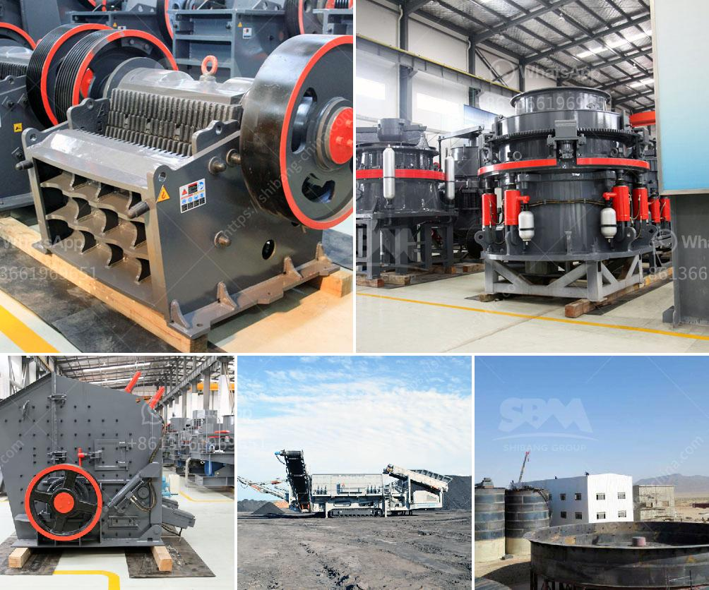

<h3>calcium carbonate machine supplier in turkey</h3>
Turkey is a country abundant in natural resources, and one such resource is calcium carbonate. With the growing demand for this mineral compound in various industries, there is an increasing need for reliable calcium carbonate machine suppliers in Turkey. These suppliers play a vital role in providing the necessary machinery and equipment to extract and process calcium carbonate from its natural sources.

One of the most reputed calcium carbonate machine suppliers in Turkey is MERMER MADENCİLİK A.Ş. With over years of experience in the industry, this company has gained a strong foothold as a trusted supplier of calcium carbonate machines. They offer a wide range of machinery and equipment, including crushers, grinders, classifiers, and calcination systems, to cater to the diverse needs of their clients.

MERMER MADENCİLİK A.Ş. ensures that their machines are of the highest quality and are manufactured using advanced technology. This ensures efficient and effective extraction and processing of calcium carbonate, resulting in superior quality products. The company also offers comprehensive after-sales services, including installation, maintenance, and technical support, to guarantee the smooth operation of their machines.

In addition to MERMER MADENCİLİK A.Ş., there are several other calcium carbonate machine suppliers in Turkey. These companies, such as ÖZKA MADENCILIK SAN. VE TİC. A.Ş. and TURKCARBON, offer a wide range of machinery and equipment to meet the diverse needs of the calcium carbonate industry.

The presence of these reliable calcium carbonate machine suppliers in Turkey has significantly contributed to the growth and development of the calcium carbonate industry in the country. Their high-quality machines, coupled with excellent after-sales services, have attracted both local and international clients. As a result, Turkey has become a major player in the global calcium carbonate market.

In conclusion, calcium carbonate machine suppliers in Turkey play a crucial role in the extraction and processing of calcium carbonate. With their high-quality machinery and excellent after-sales services, these suppliers contribute to the growth and development of the calcium carbonate industry in Turkey. Their presence has helped Turkey establish itself as a reputable supplier of calcium carbonate products worldwide.
<h3>Contact us</h3><ul><li><strong>Whatsapp:&nbsp;<a href="https://wa.me/8613661969651">+8613661969651</a></strong></li><li><a href="https://swt.shibang-china.com/?git&amp;zhl&amp;calcium carbonate machine supplier in turkey"><strong>Online Service(chat now)</strong></a></li></ul><h3>Related</h3><ul><li><a href='stone crushing business estimate.md'>stone crushing business estimate</a></li><li><a href='mill grinding machine in egypt.md'>mill grinding machine in egypt</a></li><li><a href='price of marble grinder mill.md'>price of marble grinder mill</a></li><li><a href='cec rock crushers for sale.md'>cec rock crushers for sale</a></li><li><a href='philippine limestone crusher for calcium carbonate.md'>philippine limestone crusher for calcium carbonate</a></li></ul>