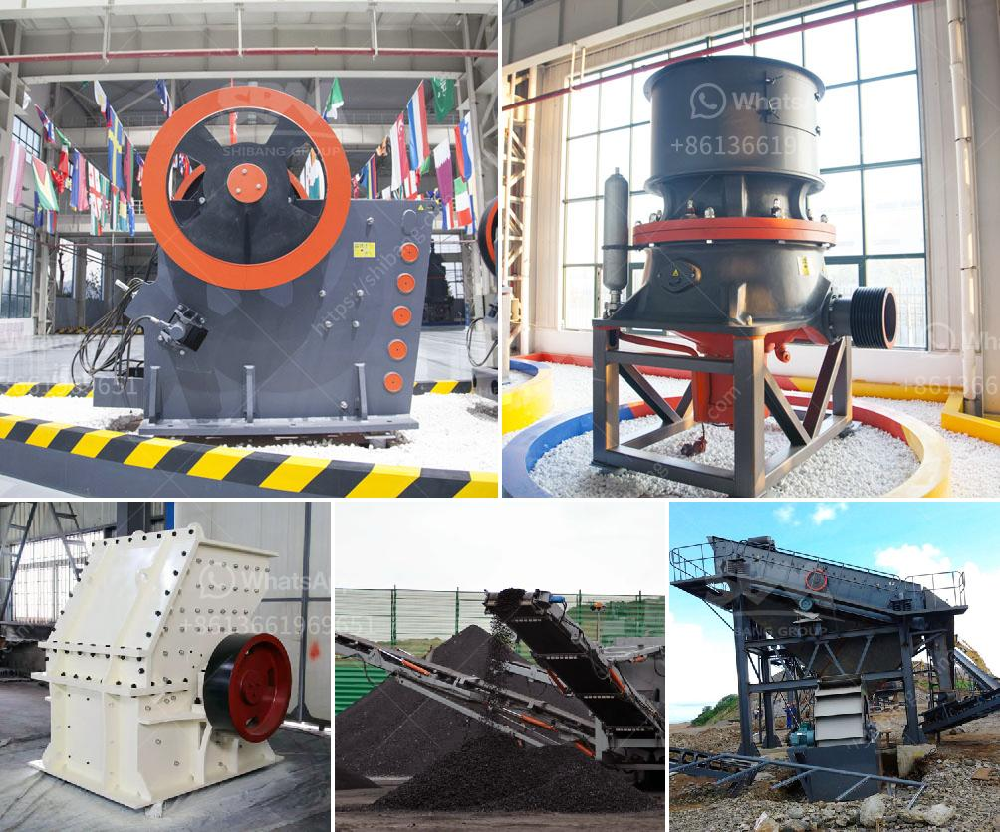

<h3>calcium carbonate making machinery in germany</h3>
Calcium carbonate powder is widely used in various industries such as construction, agriculture, and pharmaceuticals. Calcium carbonate is also used as a dietary supplement to support bone health. It is a key ingredient in cement, ceramics, and many other products. To meet the growing demand for calcium carbonate, efficient and reliable machinery is needed for its production.

Germany is known for its high-quality machinery that is used across a wide range of industries, including calcium carbonate production. With a history of engineering excellence and precision manufacturing, German machinery companies are renowned for their innovation and advanced technology.

One of the key machinery manufacturers in Germany is Hosokawa Alpine AG. They have been manufacturing industrial equipment for over 120 years and have extensive experience in producing machinery for the calcium carbonate industry. Hosokawa Alpine offers a wide range of machinery, including grinding mills, classifiers, and powder coating systems.

Grinding mills are used to break down the calcium carbonate into smaller particles. The primary type of grinding mill is the Raymond mill, which operates with a rotating grinding disc to reduce the material size. This mill is highly efficient and has a high production capacity. Another type of grinding mill commonly used is the ball mill. In this mill, the calcium carbonate is mixed with ceramic balls that continuously impact the particles, resulting in fine and homogenous powder.

Classifiers are used in conjunction with grinding mills to separate the fine particles from the coarse ones. These machines utilize principles of centrifugal force and air flow to accurately segregate the particles based on their size. The separated fine particles are then collected and used for various applications, such as paint and plastic production.

To enhance the performance and appearance of calcium carbonate powder, some manufacturers opt for powder coating systems. These systems rely on electrostatic principles to evenly coat the calcium carbonate particles with a thin layer of compounds, such as stearic acid. The coating improves the flowability, dispersibility, and durability of the powder.

German machinery manufacturers also prioritize sustainability and environmental friendliness in their designs. Energy-efficient systems and emissions control technologies are integrated into the machinery, ensuring minimal impact on the environment and reducing operating costs for calcium carbonate producers.

In summary, Germany is a hub for calcium carbonate making machinery, with companies like Hosokawa Alpine AG leading the way in providing reliable and efficient equipment. Their grinding mills, classifiers, and powder coating systems play a crucial role in producing high-quality calcium carbonate powder. With a focus on innovation and sustainability, German machinery manufacturers are continuously improving their equipment to meet the growing demands of the industry. As the demand for calcium carbonate continues to rise, the German machinery industry will play a critical role in meeting these needs efficiently and sustainably.
<h3>Contact us</h3><ul><li><strong>Whatsapp:&nbsp;<a href="https://wa.me/8613661969651">+8613661969651</a></strong></li><li><a href="https://swt.shibang-china.com/?git&amp;zhl&amp;calcium carbonate making machinery in germany"><strong>Online Service(chat now)</strong></a></li></ul><h3>Related</h3><ul><li><a href='set up a quarry for ballast stones south africa.md'>set up a quarry for ballast stones south africa</a></li><li><a href='cone crusher manufacturers in usa.md'>cone crusher manufacturers in usa</a></li><li><a href='rock crusher for sale.md'>rock crusher for sale</a></li><li><a href='conveyor belts in port system.md'>conveyor belts in port system</a></li><li><a href='design of a barite grinding mill.md'>design of a barite grinding mill</a></li></ul>