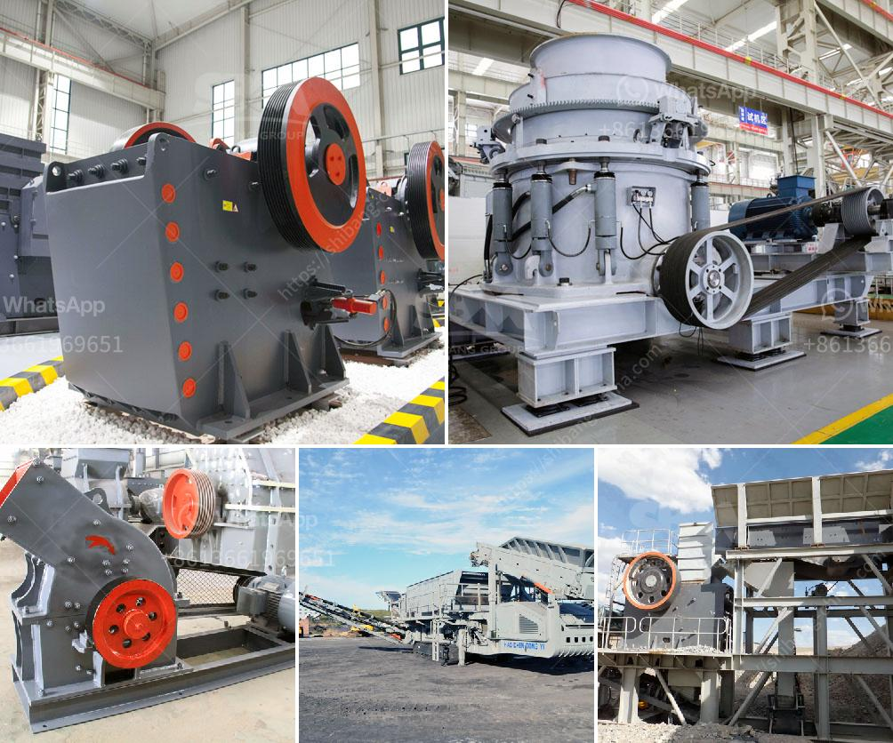

<h3>calcium carbonate plant in bulacan</h3>
A calcium carbonate plant in Bulacan has been the focal point of the industrial sector for several years. Located in the heart of Central Luzon, Bulacan is a province known for its rich mineral deposits and diverse industrial base. The establishment of the calcium carbonate plant has further solidified the province's reputation as a key player in the manufacturing industry.

Calcium carbonate, commonly known as limestone, is a ubiquitous mineral found in various forms throughout the world. It is widely used in a variety of industrial applications, including the production of cement, plaster, paints, and coatings, as well as in the construction industry. Recognizing the economic potential of this mineral, the establishment of a calcium carbonate plant in Bulacan was a strategic move.

The plant in Bulacan boasts state-of-the-art technology and is equipped with advanced machinery to ensure the production of high-quality calcium carbonate. The entire production process is closely monitored and controlled to maintain the highest standards of quality. This ensures that the product meets the specific needs and requirements of various industries.

One of the primary advantages of having a calcium carbonate plant in Bulacan is the availability of raw materials. The province is rich in limestone reserves, which serve as the main source of calcium carbonate. This eliminates the need to import the raw material, reducing production costs and ensuring a steady supply of calcium carbonate.

Moreover, the plant provides employment opportunities for the local community. It serves as a livelihood for numerous skilled workers who are involved in the production, operation, and maintenance of the plant. This not only boosts the local economy but also enhances the living conditions of the workforce and their families.

The establishment of the calcium carbonate plant in Bulacan has also contributed to the overall development of the province. It has attracted investments and new business ventures, creating a ripple effect that stimulates economic growth. The plant's presence has led to the growth of auxiliary industries, such as transportation, logistics, and packaging, further enhancing the industrial landscape of Bulacan.

Additionally, the calcium carbonate plant in Bulacan promotes sustainability and environmental conservation. It utilizes innovative technologies to minimize energy consumption and reduce the emission of harmful pollutants. The plant also implements rigorous waste management practices, ensuring the responsible disposal of by-products and minimizing environmental impact.

In conclusion, the calcium carbonate plant in Bulacan has cemented the province's position as an industrial hub. It has capitalized on the abundance of limestone reserves, providing a reliable source of calcium carbonate for various industries. Furthermore, the plant has generated employment opportunities, stimulated economic growth, and promoted sustainability. With its state-of-the-art facilities, commitment to quality, and contribution to the local community, the calcium carbonate plant in Bulacan continues to thrive and make a significant impact on the industrial sector.
<h3>Contact us</h3><ul><li><strong>Whatsapp:&nbsp;<a href="https://wa.me/8613661969651">+8613661969651</a></strong></li><li><a href="https://swt.shibang-china.com/?git&amp;zhl&amp;calcium carbonate plant in bulacan"><strong>Online Service(chat now)</strong></a></li></ul><h3>Related</h3><ul><li><a href='crusher screener forsale in sweden.md'>crusher screener forsale in sweden</a></li><li><a href='screen vibrating screen for sand.md'>screen vibrating screen for sand</a></li><li><a href='construction  demolition recycling.md'>construction & demolition recycling</a></li><li><a href='usd jaw crusher in turkey.md'>usd jaw crusher in turkey</a></li><li><a href='set up a quarry for ballast stones south africa.md'>set up a quarry for ballast stones south africa</a></li></ul>