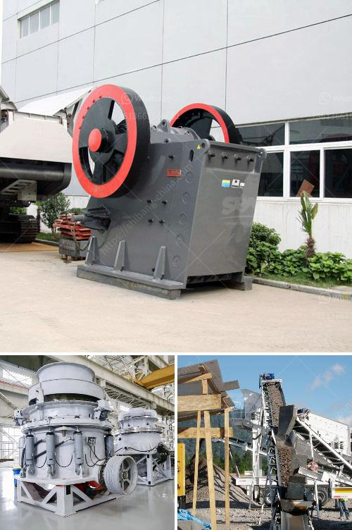

<h3>calcium carbonate plant industry</h3>
The calcium carbonate plant industry is a diverse sector that plays a crucial role in various sectors of the economy. Calcium carbonate is a vital component used in the production of numerous materials such as plastics, rubber, paints, and coatings. It is also a key ingredient in the construction industry for the manufacture of cement and concrete. The industry is characterized by its high demand, global reach, and environmentally sustainable practices.

One of the primary uses of calcium carbonate is in the manufacturing of plastics. It is added to plastic products to enhance their durability, strength, and heat resistance. Calcium carbonate improves the mechanical properties of plastics, making them more suitable for various applications. Furthermore, it reduces the production cost of plastics, making them an affordable and widely used material.

In the construction industry, calcium carbonate is used in the production of cement. Cement is an essential material used in the building of infrastructure such as houses, bridges, and roads. Calcium carbonate acts as a filler and provides strength to the cement mixture, making it ideal for construction applications. It also helps to control the setting time of the cement, allowing for faster and more efficient construction processes.

Paints and coatings also heavily rely on the benefits provided by calcium carbonate. It is used as a pigment and filler in the production of various paint formulations. Calcium carbonate improves the opacity, brightness, and whiteness of paints, resulting in better coverage and color intensity. Additionally, it enhances the paint's rheological properties, making it easier to apply and spread evenly on different surfaces.

The calcium carbonate plant industry is witnessing significant growth due to its versatility and widespread use in different manufacturing processes. Manufacturers are investing in technologically advanced plants to meet the increasing demand for calcium carbonate. These plants utilize sustainable practices and state-of-the-art technology to reduce environmental impact and promote resource efficiency.

One notable trend in the industry is the adoption of carbon capture and storage (CCS) technology. This technology captures carbon dioxide emissions from the production process and stores it in underground reservoirs. Implementing CCS reduces greenhouse gas emissions, mitigating the plant industry's environmental impact.

Furthermore, the industry is focused on sourcing calcium carbonate from renewable sources. Traditionally, calcium carbonate was extracted from limestone quarries, which required significant energy consumption and caused environmental degradation. However, the industry now utilizes alternative sources, such as waste streams from various industries, to reduce reliance on limestone mining.

In conclusion, the calcium carbonate plant industry is an essential sector that caters to the needs of various industries such as plastics, construction, and paints. This versatile material improves the properties of products, enhances their performance, and contributes to the economic growth of nations. The industry's focus on sustainable practices and advanced technologies ensures a more environmentally friendly and resource-efficient future.
<h3>Contact us</h3><ul><li><strong>Whatsapp:&nbsp;<a href="https://wa.me/8613661969651">+8613661969651</a></strong></li><li><a href="https://swt.shibang-china.com/?git&amp;zhl&amp;calcium carbonate plant industry"><strong>Online Service(chat now)</strong></a></li></ul><h3>Related</h3><ul><li><a href='stone crushers in belen.md'>stone crushers in belen</a></li><li><a href='coal mining equipment south africa for sale.md'>coal mining equipment south africa for sale</a></li><li><a href='crusher for bed ash manufacturers.md'>crusher for bed ash manufacturers</a></li><li><a href='equipment required for producing lime for new plant.md'>equipment required for producing lime for new plant</a></li><li><a href='stone crusher machine price in africa south.md'>stone crusher machine price in africa south</a></li></ul>