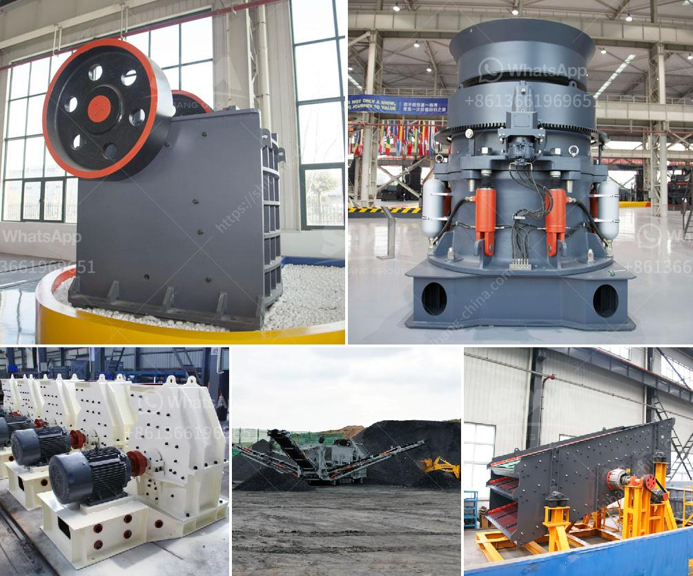

<h3>calcium carbonate powder processing plant</h3>
Calcium carbonate is an inorganic compound with versatile applications in a vast range of industries. It is commonly used as a filler agent in various products, such as paper, plastics, rubber, paint, and adhesives, among others. For this reason, the demand for calcium carbonate powder processing plants is on the rise.

A calcium carbonate powder processing plant includes a series of machines, such as crushers, mill equipment, and grinding mills. All of these machines interact with each other in the calcium carbonate processing plant to complete the production process. In order to minimize the cost and pollution, the raw calcium carbonate should be processed with the following steps.

1. Crushing: The calcium carbonate blocks are crushed by the crusher to the desired size, which is suitable for the grinding stage. The crusher is essential for this process as it removes the bulk of the impurities and ensures the calcium carbonate is ready for the next stage.

2. Grinding: The crushed calcium carbonate is transferred to the grinding mill for fine grinding. In the grinding mill, the calcium carbonate particles are ground into a fine powder that can be used as a filler agent in various products. The grinding process is critical for achieving the desired particle size distribution and ensuring the product's quality.

3. Classification: After grinding, the calcium carbonate powder needs to be classified according to its particle size. This is achieved by using a classifier, which separates the fine and coarse particles. The classified calcium carbonate powder is then collected and stored in silos for further use.

4. Packaging: The final step in the calcium carbonate powder processing plant is packaging. The fine powder is packaged in bags or bulk containers, ready for distribution to customers. The packaging process ensures that the product is protected from contamination and moisture, ensuring its quality during transportation and storage.

It is essential to note that the calcium carbonate powder processing plant requires careful consideration of several factors, such as raw material quality, processing equipment, and plant design. The raw material quality directly affects the final product's quality, so it should be carefully selected and tested for impurities. The processing equipment, including crushers, mills, and classifiers, should be chosen based on the desired production capacity and particle size distribution. Additionally, the plant design should optimize the production process by ensuring efficient material handling and minimizing energy consumption.

In conclusion, a calcium carbonate powder processing plant is a vital investment opportunity in today's market. With the increasing demand for calcium carbonate products, such as fillers, the production process should be carefully designed and optimized to ensure high-quality output. By following the proper steps, including crushing, grinding, classification, and packaging, manufacturers can produce calcium carbonate powder that meets the industry's stringent requirements.
<h3>Contact us</h3><ul><li><strong>Whatsapp:&nbsp;<a href="https://wa.me/8613661969651">+8613661969651</a></strong></li><li><a href="https://swt.shibang-china.com/?git&amp;zhl&amp;calcium carbonate powder processing plant"><strong>Online Service(chat now)</strong></a></li></ul><h3>Related</h3><ul><li><a href='gypsum production equipments in philippines.md'>gypsum production equipments in philippines</a></li><li><a href='high capacity r ore raymond mill with competitive price.md'>high capacity r ore raymond mill with competitive price</a></li><li><a href='cost of stone crusher in nigeria.md'>cost of stone crusher in nigeria</a></li><li><a href='crusher machine for mineral powder.md'>crusher machine for mineral powder</a></li><li><a href='second hand cement mill in india.md'>second hand cement mill in india</a></li></ul>