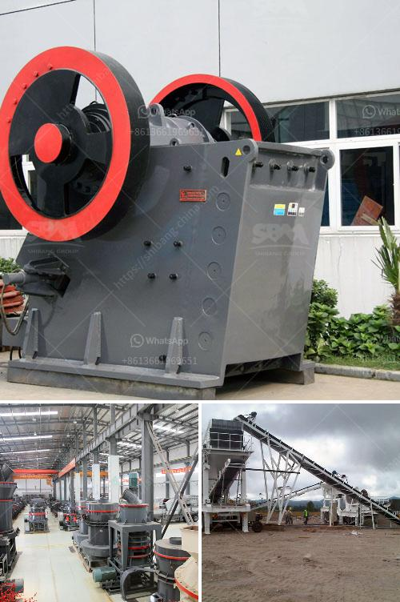

<h3>calcium carbonate production plant</h3>
Calcium carbonate is a common mineral found in rocks and limestone deposits. It is the main component of shells and pearls, and it is also a key ingredient in many construction materials, such as cement, plaster, and paint. Because of its versatility and widespread use, the demand for calcium carbonate has been steadily increasing, leading to the establishment of calcium carbonate production plants.

A calcium carbonate production plant is a facility where calcium carbonate is produced from limestone rocks or other sources of calcium carbonate. The manufacturing process consists of several steps, including crushing, grinding, and classifying the limestone rocks and then calcining them at very high temperatures to remove impurities. The resulting calcium oxide is then hydrated to form calcium hydroxide, which is further carbonated to produce calcium carbonate.

One of the main advantages of calcium carbonate production plants is their high efficiency. These plants are designed to extract calcium carbonate from raw materials with minimal waste and energy consumption. Advanced technology and equipment are used to ensure the purity and quality of the final product.

Calcium carbonate production plants can vary in size depending on the production capacity required. Small-scale plants can produce a few hundred tons of calcium carbonate per day, while large-scale plants can produce thousands of tons per day. The production capacity can be further increased by adding additional production lines or expanding the existing ones.

The market for calcium carbonate is vast and diverse. The main industries that rely on calcium carbonate production plants are the construction, paper, plastics, and paint industries. Calcium carbonate is used in the construction industry for making cement and asphalt filler, as well as in the production of bricks, tiles, and plaster. In the paper industry, it is used as a filler and coating agent to improve the quality and brightness of paper. Calcium carbonate is also used in the plastics industry to improve the mechanical properties of plastic products. In the paint industry, it is used as a pigment and filler to enhance the color and texture of paint.

One major challenge facing calcium carbonate production plants is environmental sustainability. The extraction and processing of raw materials, such as limestone rocks, can have a significant impact on the environment. Some production plants have implemented measures to minimize their carbon footprint, such as using renewable energy sources and implementing water conservation practices. Additionally, efforts are being made to find alternative sources of calcium carbonate, such as waste materials from other industries, to reduce the reliance on natural resources.

In conclusion, calcium carbonate production plants play a crucial role in meeting the growing demand for calcium carbonate in various industries. These plants utilize advanced technology and efficient processes to extract and process calcium carbonate from raw materials. The market for calcium carbonate is vast and diverse, making it a key ingredient in many construction materials, paper products, plastics, and paints. The industry is also striving towards environmental sustainability by implementing environmentally friendly practices and exploring alternative sources of calcium carbonate.
<h3>Contact us</h3><ul><li><strong>Whatsapp:&nbsp;<a href="https://wa.me/8613661969651">+8613661969651</a></strong></li><li><a href="https://swt.shibang-china.com/?git&amp;zhl&amp;calcium carbonate production plant"><strong>Online Service(chat now)</strong></a></li></ul><h3>Related</h3><ul><li><a href='simple gold mining machinery with prices.md'>simple gold mining machinery with prices</a></li><li><a href='jaw crusher from china.md'>jaw crusher from china</a></li><li><a href='kaolin portable crusher provider in nigeria.md'>kaolin portable crusher provider in nigeria</a></li><li><a href='caterpillar stone crusher.md'>caterpillar stone crusher</a></li><li><a href='small scale gold mining in kadoma zimbabwe.md'>small scale gold mining in kadoma zimbabwe</a></li></ul>